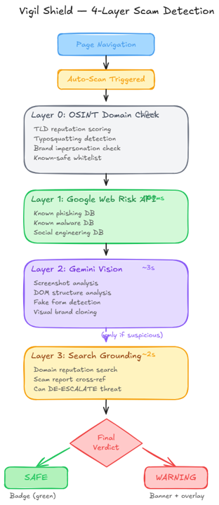
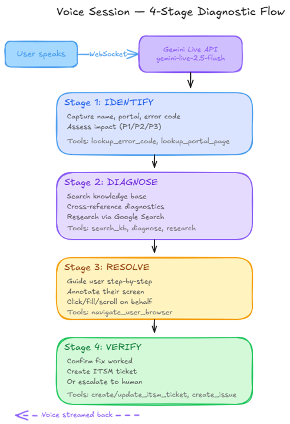
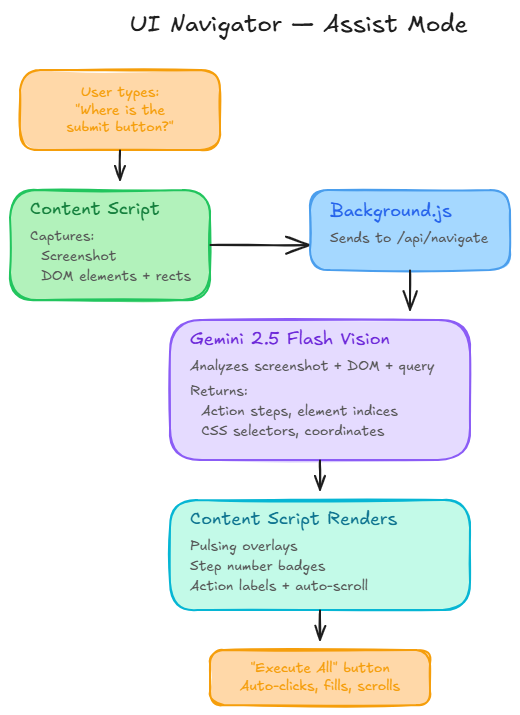

# Vigil

### Real-Time Scam Shield + Voice-First IT Support

> A Chrome extension that silently scans every page you visit with a 5-layer AI detection pipeline — including content claim verification against official sources. When it finds something dangerous, it warns you before you get phished. When you need help, talk to Theepa — she sees your screen and guides you step-by-step. All powered by Gemini Live.

**[Try It Live](https://resolve-743776360861.us-central1.run.app)** | **[Demo Video](#)** | **[Devpost](https://devpost.com)**

---

## What Is This?

**The internet is getting more dangerous, and people can't keep up.**

Phishing pages look pixel-perfect. AI-generated fake login forms fool even careful users. Your mom almost enters her card details on a site that "awarded" her a free iPhone. She's not naive — she's just not trained to spot the difference between a real checkout and a phishing page.

And when something does go wrong — IT support is broken. The average ticket takes hours, most of that spent describing what you see on screen. "What error do you see?" "What page are you on?" "Did you try clearing your cache?"

**Vigil fixes both.**

1. **Vigil Shield** — A Chrome extension that auto-scans every page with a 5-layer pipeline (OSINT + Google Web Risk + Gemini Vision + Google Search + Content Claim Verification). Green badge = safe. Red banner = get out.
2. **Theepa** — A voice-first IT agent that sees your screen, runs real diagnostics, and creates ITSM tickets. She speaks 20 languages natively.

---

## Architecture


```
                    ┌──────────────────────────────────────────────────────┐
                    │               Google Cloud Platform                  │
                    │                                                      │
 ┌──────────┐      │  ┌───────────┐    ┌──────────────────────────────┐  │
 │ Chrome   │◄────►│  │ FastAPI   │◄──►│ Gemini 2.5 Flash             │  │
 │Extension │ REST │  │ Server    │    │ Vision + Search (Vertex AI)  │  │
 │ Shield   │      │  │           │    └──────────────────────────────┘  │
 └──────────┘      │  │           │    ┌──────────────────────────────┐  │
                    │  │ 4 Agents  │◄──►│ Google Web Risk API          │  │
 ┌──────────┐      │  │ 16 Tools  │    └──────────────────────────────┘  │
 │ Web App  │◄────►│  │ Sessions  │    ┌──────────────────────────────┐  │
 │ Vite+WC  │ WS   │  │ Activity  │◄──►│ Gemini Live 2.5 Flash        │  │
 │ WebAudio │      │  │ Feed      │    │ Native Audio (Vertex AI)     │  │
 └──────────┘      │  └───────────┘    └──────────────────────────────┘  │
                    │                                                      │
                    │  Cloud Run │ Terraform │ Artifact Registry │ IAM     │
                    └──────────────────────────────────────────────────────┘
```

---

## How It Works

### 1. Vigil Shield — 4-Layer Scam Detection



Every page you visit gets scanned automatically. No clicks needed. The Chrome extension runs a cascading pipeline:

| Layer | What | Speed | How It Works |
|-------|------|-------|-------------|
| **0. OSINT** | Domain heuristics | <1ms | TLD reputation, typosquatting detection, brand impersonation, known-safe whitelist, domain authority score (0-100) |
| **1. Web Risk** | Google's threat DB | ~100ms | Known phishing, malware, social engineering — Google's database of bad URLs |
| **2. Vision** | Gemini sees the page | ~3s | Screenshot + DOM → fake forms, visual cloning, urgency scams, AI-generated content |
| **3. Search** | Verify with Google | ~2s | Only triggers if Layer 2 flags something. Searches for scam reports. **Can de-escalate** — confirms legit sites |
| **4. Claims** | Verify content claims | ~2s | If content references a third-party brand (e.g. "Qatar Airways" on Reddit), checks official site + Reuters/BBC/AP. Returns: verified, unverified, or debunked |

Green ✓ on the extension icon = all 5 layers passed. Red warning banner = get out.

**Smart de-escalation**: Most security tools only escalate. Vigil can *lower* a threat level when Google Search confirms a flagged site is actually legitimate. This eliminates false positives — because flagging google.com as a scam is worse than missing one.

### 2. Fake Content Detection + Danger Zone Annotations

Vigil doesn't just scan URLs. It reads the page:

- **Fact-checking**: "Is this article true?" → Vigil cross-references claims against Reuters, BBC, AP. Returns citations.
- **Danger zone annotations**: Vigil identifies deceptive UI elements (fake buttons, hidden redirects, dark patterns) and the Chrome extension renders red warning overlays directly on the page.
- **AI content detection**: Spots AI-generated fake news, synthetic reviews, and deepfake indicators.

### 3. Theepa — Voice-First IT Agent



**Model**: `gemini-live-2.5-flash-native-audio` via Vertex AI

When you need help, talk to Theepa. She listens, sees your screen, and runs through a 4-stage diagnostic protocol:

```
IDENTIFY → DIAGNOSE → RESOLVE → VERIFY
   │            │           │          │
   ├─ Error?    ├─ KB search├─ Voice   ├─ Fix confirmed?
   ├─ Page?     ├─ Error DB │  guides  ├─ Create ticket
   └─ Priority? ├─ Portal   │  you on  └─ Or escalate
                └─ Web search│  screen
                             └─ Annotations
                                on your page
```

She speaks **20 languages** natively. Not translation — the model thinks in Tamil, Hindi, German, Japanese.

### 4. Voice-Driven UI Navigation



No text input in the extension. UI navigation flows through voice:

```
User speaks          →  Gemini Live calls navigate_user_browser
                     →  Server tells extension to capture page
                     →  Extension grabs screenshot + DOM elements
                     →  Server sends to Gemini Vision
                     →  Vision returns: "highlight element #23"
                     →  Extension renders pulsing overlay on button
                     →  Theepa says: "I've highlighted it for you"
```

Voice is the single control plane. One conversation handles both diagnosis AND page navigation.

---

## Google ADK Multi-Agent Orchestration

4 agents. 16 tools. Hierarchical delegation.

```
┌──────────────────────────────────────────────────────────┐
│  Theepa (root_agent) — THE VOICE                         │
│  Model: gemini-2.5-flash │ 8 IT FunctionTools            │
│                                                          │
│  ┌──────────────────────────┐  ┌───────────────────────┐ │
│  │  Researcher Sub-Agent    │  │  Vigil Sub-Agent      │ │
│  │  google_search           │  │  7 Shield FunctionTools│ │
│  │  (IT research)           │  │  (scam/phishing/fake  │ │
│  │                          │  │   content detection)  │ │
│  │  ⚠ ADK constraint:      │  │                       │ │
│  │  google_search CANNOT    │  │  ┌──────────────────┐ │ │
│  │  share an agent with     │  │  │ Threat Intel     │ │ │
│  │  other tools             │  │  │ google_search    │ │ │
│  └──────────────────────────┘  │  │ (scam/fact check)│ │ │
│                                │  └──────────────────┘ │ │
│                                └───────────────────────┘ │
└──────────────────────────────────────────────────────────┘
```

Theepa is the voice interface. She speaks for everything. But the real engine is Vigil — the 7-tool shield pipeline that scans, detects, fact-checks, and annotates.

**Flow**: User says "Is this page safe?" → Theepa transfers to Vigil → Vigil runs shield tools → threat_intel searches for scam reports → findings return to Theepa → Theepa speaks the result.

**Flow**: User says "I see error AUTH-003" → Theepa fires IT tools in parallel → researcher searches latest outage info → Theepa synthesizes and speaks the resolution.

---

## 16 Backend Tools — 4 ADK Agents

### Vigil Sub-Agent (7 Shield Tools)

| # | Tool | What It Does |
|---|------|-------------|
| 1 | `scan_url_safety` | Full 5-layer shield scan (OSINT + Web Risk + Vision + Search + Claim Verification) |
| 2 | `check_domain_reputation` | Quick OSINT + Web Risk domain check — instant verdict |
| 3 | `analyze_page_for_threats` | Gemini Vision detects visual scams, fake forms, impersonation |
| 4 | `verify_domain_legitimacy` | Google Search cross-references domain against scam reports |
| 5 | `detect_fake_content` | Fact-checks news/social media claims with citations from Reuters, BBC, AP |
| 6 | `report_threat` | Logs confirmed threats with full evidence to threat database |
| 7 | `highlight_danger_zones` | Identifies deceptive UI elements → Chrome extension renders red overlays |

### Theepa Agent (8 IT Helpdesk Tools)

| # | Tool | What It Does |
|---|------|-------------|
| 8 | `search_knowledge_base` | Fuzzy search across 20 IT helpdesk articles |
| 9 | `lookup_error_code` | Resolves codes across 7 categories (AUTH, FORM, PAY, DOC, TECH, VISA, ID) |
| 10 | `lookup_portal_page` | Portal navigation paths + known issues for any page |
| 11 | `diagnose_issue` | Cross-references KB + errors + pages → root cause analysis |
| 12 | `create_issue` | Logs problems with auto-severity + deduplication |
| 13 | `create_itsm_ticket` | Full ITSM ticket with diagnostic report attached |
| 14 | `update_itsm_ticket` | Status updates, resolution notes, escalation path |
| 15 | `navigate_user_browser` | Triggers Chrome extension → Gemini Vision → page annotations |

### + 2 Google Search Sub-Agents

| Agent | Role |
|-------|------|
| `threat_intel` | Scam/fact verification — domain reputation, scam reports, fact-checks |
| `researcher` | IT research — portal outages, known issues, government service updates |

---

## Cloud Deployment

| Component | Technology | Where |
|-----------|-----------|-------|
| Chrome Extension | Manifest V3 + Shield Pipeline | User's Browser |
| Backend API | FastAPI + WebSocket | Cloud Run |
| Vision/Search | `gemini-2.5-flash` | Vertex AI |
| Voice Model | `gemini-live-2.5-flash-native-audio` | Vertex AI |
| Threat Database | Google Web Risk API | GCP |
| Agent Framework | Google ADK | Cloud Run |
| Web Frontend | Vite + Web Components + Web Audio API | Cloud Run |
| Infrastructure | Terraform + Docker | Artifact Registry |

---

## Quick Start

```bash
# Clone
git clone https://github.com/vigneshbarani24/Gemini-AI-Agents.git
cd Gemini-AI-Agents

# Backend
pip install -r requirements.txt

# Frontend
cd frontend && npm install && npm run build && cd ..

# Configure
cp .env.example .env
# Edit .env: set PROJECT_ID=your-gcp-project-id

# Run
python -m uvicorn server.main:app --host 0.0.0.0 --port 8080
```

### Chrome Extension (Vigil Shield)
1. Open `chrome://extensions/` → Enable **Developer mode**
2. Click **Load unpacked** → select the `extension/` folder
3. Click the Vigil icon → enter `http://localhost:8080` → **Connect**
4. Shield auto-scans every page. Green ✓ = safe. Red banner = threat detected.

### Deploy to Cloud Run
```bash
export PROJECT_ID=your-project-id
bash deploy.sh        # Standard deploy
bash deploy.sh --adk  # With ADK multi-agent
```

---

## API Endpoints

| Endpoint | What |
|----------|------|
| `POST /api/shield` | Run 5-layer shield scan (OSINT → Web Risk → Vision → Search → Claims) |
| `GET /api/threats` | Vigil threat log — confirmed threats with evidence |
| `POST /api/navigate` | Gemini Vision page analysis |
| `POST /api/adk/chat` | ADK multi-agent text chat |
| `WS /ws` | Bidirectional voice streaming |
| `GET /api/activity` | Live activity feed — every scan, tool call, session logged |
| `GET /api/tickets` | All ITSM tickets |
| `GET /health` | Server health + ADK status |
| `GET /api/status` | Multi-agent status — 4 agents, 16 tools, features |

---

## What Makes This Different

| Typical Submission | Vigil |
|-------------------|-------|
| 1 agent, 2-3 tools | **4 agents, 16 tools** — multi-agent orchestration with ADK sub-agents |
| No proactive protection | **Auto-scans every page** — 5-layer pipeline catches threats before you click |
| Security tools only escalate | **Smart de-escalation** — lowers threat when Search confirms legitimacy |
| No fact-checking | **Fake content detection with citations** — Reuters, BBC, AP cross-references |
| Trust the domain, ignore content | **Content claim verification** — "Qatar Airways" on Reddit? Checks qatarairways.com + news sources |
| Screenshot analysis | Chrome extension that **warns about danger zones and highlights deceptive UI** |
| English only | **20 languages** natively — speak Tamil, get results in Tamil |
| Tools called one at a time | **16 tools firing in parallel** — shield scan + KB lookup + error diagnosis simultaneously |
| No transparency | **Live orchestration logs** — see every agent transfer, tool call, and reasoning in real time |
| Manual deployment | **Terraform IaC** — one command to production |

---

## Challenges (The Real Ones)

1. **Gemini Vision thought Google was a scam.** First shield version flagged google.com — "contains login form, possible phishing." Rewrote the prompt 6 times to get "safe by default" right. Then it flagged GitHub. Then Amazon. Getting a vision model to NOT be paranoid is harder than making it paranoid.

2. **google_search broke all my other tools.** Added it to the main agent. Everything stopped. No error. Just silence. 4 hours later: ADK requires it in a separate sub-agent. Not in the docs.

3. **Wrong model ID everywhere.** It's `gemini-live-2.5-flash-native-audio`. Not `gemini-2.0-flash-live`. Not `gemini-2.5-flash-live`. Trial and error.

4. **Content scripts don't exist on pre-installed tabs.** Built `ensureContentScript()` — ping, if no response, inject, wait 300ms, retry.

5. **ADK sessions are async now.** `get_session()` returns a coroutine. Got `'coroutine' object has no attribute 'id'` and questioned my career for 30 minutes.

---

## What's Next

- **Mobile-native Vigil** — the real vision: every phone ships with this. Built-in scam shield + voice support. No extension needed — the OS does it. Vigil as a platform service.
- **Safe shopping** — same pipeline, expanded prompts. Fake storefronts, too-good-to-be-true deals, AI-generated reviews, seller verification. Voice: "Is this deal legit?" → full analysis.
- **Real WHOIS** — domain age is a strong scam signal, currently heuristic-only
- **Threat intelligence sharing** — share confirmed threats across all Vigil users
- **Multi-tab shield dashboard** — scan history, threat trends, analytics
- **Enterprise** — SSO, custom KBs, role-based access

---

## Project Structure

```
├── resolve/                    # ADK package
│   └── agent.py                # 4-agent graph: Vigil + Theepa + Researcher + Threat Intel
├── server/
│   ├── main.py                 # FastAPI + WebSocket + REST + Activity Feed
│   ├── gemini_live.py          # Gemini Live API bidirectional streaming
│   ├── adk_agent.py            # ADK multi-agent definition (conditional)
│   ├── prompts.py              # Vigil + Theepa personas (400+ lines)
│   ├── session_state.py        # 4-stage diagnostic state machine
│   ├── agents/
│   │   └── diagnostic_expert.py # Cross-reference diagnostic engine
│   └── tools/                  # 16 tool implementations
│       ├── shield_analyzer.py  # 5-layer scam detection engine (OSINT+WebRisk+Vision+Search+Claims)
│       ├── vigil_tools.py      # 7 Vigil Shield ADK FunctionTools
│       ├── kb_search.py        # Knowledge base search
│       ├── portal_lookup.py    # Error codes + portal pages
│       ├── itsm.py             # Ticket CRUD
│       ├── issue_tracker.py    # Issue logging
│       ├── search_grounding.py # Google Search grounding
│       └── ui_navigator.py     # Gemini Vision page analysis
├── extension/                  # Chrome Extension (Manifest V3) — Vigil Shield
├── frontend/                   # Vite + Web Components SPA
├── terraform/                  # Cloud Run IaC
├── docs/                       # Architecture diagrams + submission
├── Dockerfile
└── deploy.sh
```

---

## Built With

Gemini 2.5 Flash, Google Web Risk API, Google Search Grounding, Google ADK, Gemini Live API, Vertex AI, Python, FastAPI, WebSocket, Chrome Extension (Manifest V3), Vite, Web Components, Web Audio API, Cloud Run, Terraform, Docker

## Categories
Live Agents, UI Navigator

## Team
**Solo Developer** — Built for the Gemini Live Agent Challenge

---

*Built with too much coffee and not enough sleep. But it works.*
