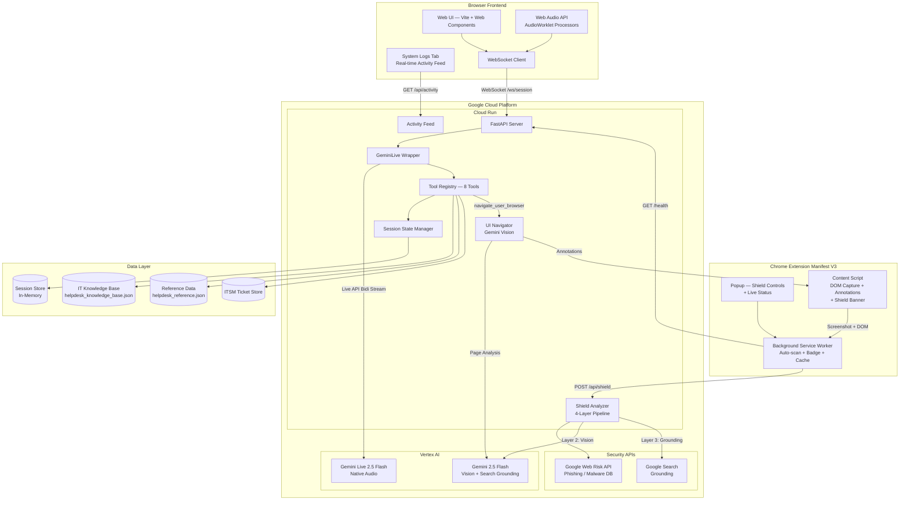
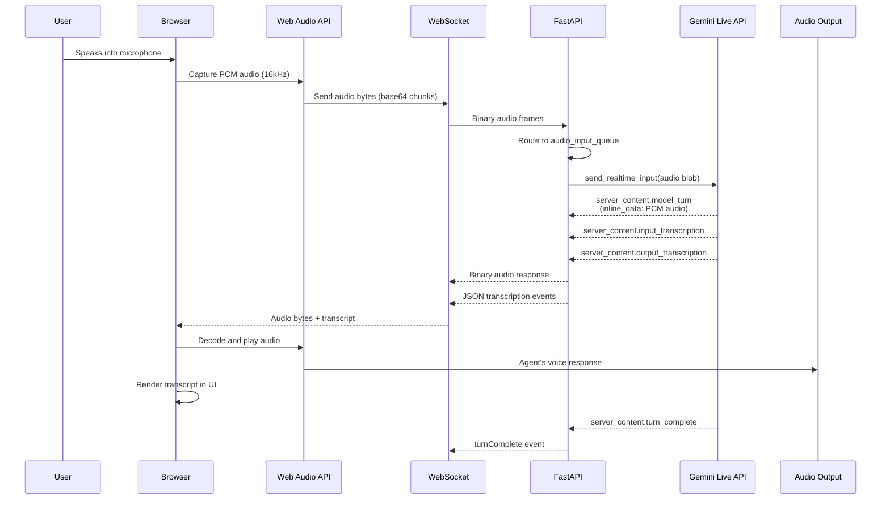
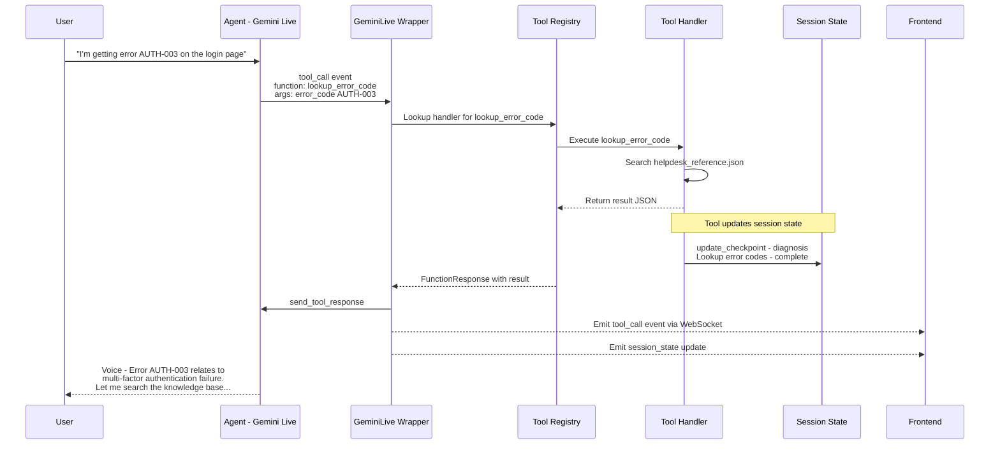
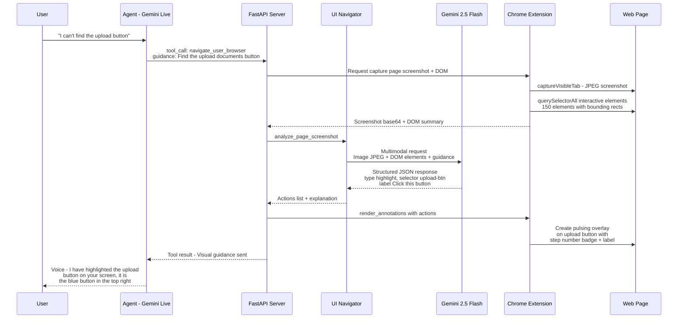
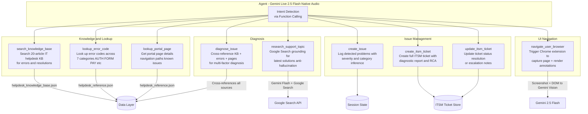
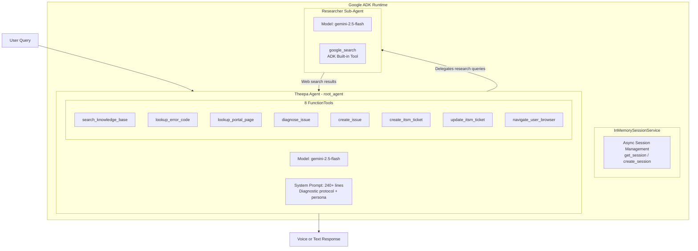
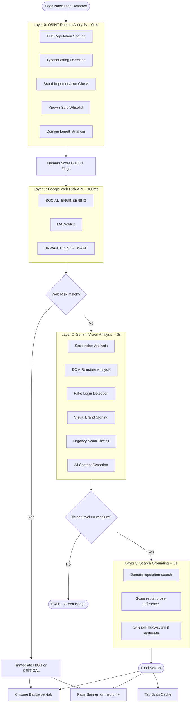
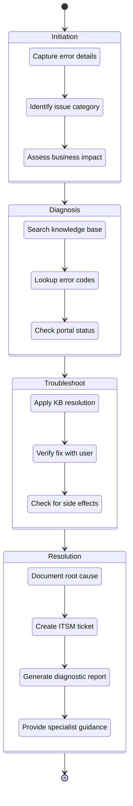
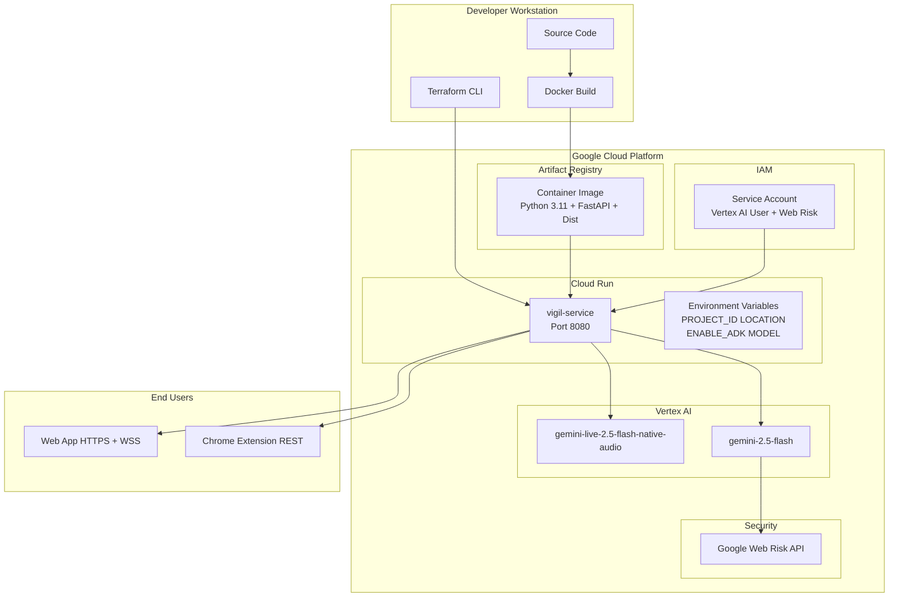
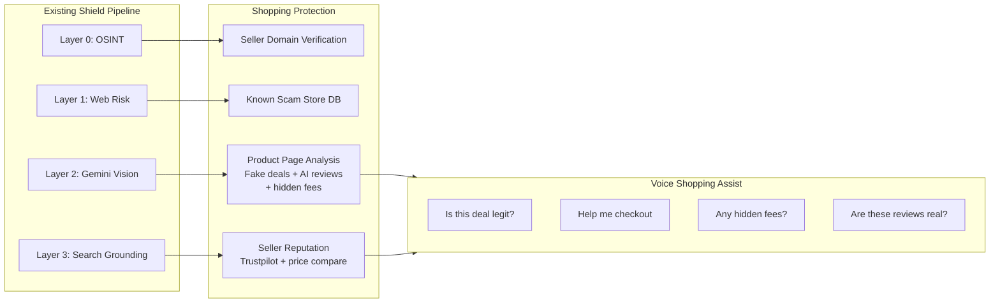

# Vigil — Architecture Diagrams

**Vigil** is an AI-powered IT support and scam protection platform developed by KaarTech UK. At its core is a **voice-first support agent** powered by the Gemini Live API. The agent sees the user's screen, listens to their voice, diagnoses IT issues in real time, and manages the full lifecycle of incident resolution. Simultaneously, the **Vigil Shield** Chrome extension runs a 4-layer scam detection pipeline on every page the user visits.

This document provides a comprehensive set of architecture diagrams covering the system's major components, data flows, and deployment topology.

---

## 1. System Architecture Overview

The high-level architecture is organised around four layers: the browser-based frontend + Chrome extension, the FastAPI backend, the Gemini AI engine on Google Cloud, and the data/tooling layer. Real-time voice communication flows over WebSocket, while REST endpoints handle shield scans, UI navigation, and session management.

**Key observations:**

- The Gemini Live session uses a bidirectional stream for real-time audio. Tool calls flow through the same connection.
- The Chrome extension is **shield-only** — it has no text input for UI help. UI navigation is driven entirely through voice: the user speaks, Gemini Live calls the `navigate_user_browser` tool, which triggers the extension to capture the page and render annotations.
- Shield scans use a separate Gemini Flash call (not the Live session) for vision analysis and search grounding.
- Session state is held in-memory on the FastAPI server, scoped to each session token.

---

## 2. Real-Time Voice Flow

This sequence diagram traces a single voice interaction from the moment the user speaks through to the audio response played back in the browser. It also shows how voice commands drive UI annotations on the Chrome extension.

**Key observations:**

- Audio flows as raw PCM bytes over WebSocket — no HTTP overhead.
- The model is `gemini-live-2.5-flash-native-audio` — native speech-to-speech with no separate STT/TTS pipeline.
- 20+ languages supported natively by the model.
- AudioWorklet processors (`capture-processor.js` and `playback-processor.js`) handle zero-latency audio capture and playback.

---

## 3. Tool Orchestration Flow

When Gemini detects that a user's request requires a backend action, it emits a `tool_call` event. The backend dispatches the call to the appropriate handler, updates session state, and returns the result so the agent can formulate a voice response.

**Key observations:**

- Tool handlers can be synchronous or asynchronous. The GeminiLive wrapper detects the type via `inspect.iscoroutinefunction` and dispatches accordingly.
- After every tool call, the backend logs to the Activity Feed and emits an updated `session_state` event to the frontend.
- The agent can call multiple tools in sequence within a single turn (e.g., `lookup_error_code` then `search_knowledge_base` then `diagnose_issue`).

---

## 4. Voice-Driven UI Navigation Flow

This is the key architectural differentiator: **UI navigation is voice-driven, not text-driven**. The user speaks to the agent, the agent calls the `navigate_user_browser` tool, which triggers the Chrome extension to capture the page and render visual annotations.

**Key observations:**

- The Chrome extension has **no text input for UI help**. All UI navigation flows through voice.
- The content script captures up to 150 interactive elements with bounding rects, selectors, and attributes.
- Gemini Vision cross-references the screenshot with the DOM summary for precise element targeting.
- Annotations include pulsing overlays, step number badges, and action labels.
- The extension can also auto-execute actions: `click()`, `fill()`, `scroll()` on behalf of the user.

---

## 5. Eight-Tool Ecosystem

The agent's eight tools are organised into four functional categories. Each tool is declared as a Gemini function declaration and registered in the central tool registry at startup.

---

## 6. ADK Multi-Agent Architecture

When running in ADK mode, the system uses Google's Agent Development Kit for multi-agent orchestration. The `google_search` tool **must** be isolated in a separate sub-agent due to an ADK constraint.

**Key observations:**

- ADK's `google_search` tool cannot coexist with other tools in the same agent — this is an undocumented constraint requiring sub-agent isolation.
- The Researcher sub-agent is only invoked when the internal knowledge base lacks the answer.
- ADK mode uses `gemini-2.5-flash` (text), while primary voice mode uses `gemini-live-2.5-flash-native-audio`.
- `InMemorySessionService.get_session()` and `create_session()` are async and must be awaited.

---

## 7. Vigil Shield — 4-Layer Detection Pipeline

The Shield runs silently in the Chrome extension, auto-scanning every page navigation. It uses a cascading 4-layer pipeline with smart gating to minimise latency for safe sites.

**Pipeline mechanics:**

- **Layer 0** is pure heuristic — no API calls, instant results. Known-safe whitelist prevents false positives.
- **Layer 1** is fast (~100ms) and catches known threats from Google's databases.
- **Layer 2** is deep analysis — Gemini Vision examines the actual page content.
- **Layer 3** only triggers when Layer 2 flags something suspicious — minimising latency for safe sites.
- **Smart de-escalation**: Layer 3 can LOWER the threat level if Google Search confirms legitimacy.

---

## 8. Four-Stage Diagnostic Pipeline

Every voice support session follows a structured four-stage diagnostic pipeline with 12 checkpoints tracked in real time.

**Pipeline mechanics:**

- Checkpoints initialise as `pending` when a session is created.
- As tools execute, checkpoints update to `in_progress`, `complete`, or `skipped`.
- Supports **auto-advancement**: completing a later-stage checkpoint auto-advances the session stage.
- All updates logged to Activity Feed and visible in System Logs tab.

---

## 9. Deployment Architecture

Vigil is deployed on Google Cloud using a containerised architecture managed by Terraform.

---

## 10. Shopping Extension — Future Vision

Vigil's 4-layer shield pipeline naturally extends to **safe shopping** with zero new tools — only expanded prompts.

**Same pipeline, expanded prompts — zero new code needed.**

---

## Appendix: Technology Stack Summary

| Layer | Technology | Purpose |
|-------|-----------|---------|
| Frontend | Vite, Web Components, Web Audio API | Browser UI, audio capture, system logs |
| Extension | Chrome Manifest V3, Content Scripts | Shield auto-scan, DOM capture, annotations |
| Backend | Python 3.11, FastAPI, WebSocket, Uvicorn | API server, session management, tool orchestration |
| AI — Voice | Gemini Live 2.5 Flash Native Audio (Vertex AI) | Real-time bidirectional voice + tool calling |
| AI — Vision | Gemini 2.5 Flash (Vertex AI) | Shield detection, UI navigation, search grounding |
| Security | Google Web Risk API | Known phishing/malware database lookup |
| ADK | Google Agent Development Kit | Multi-agent orchestration (optional mode) |
| Infrastructure | Cloud Run, Docker, Terraform, Artifact Registry | Containerised deployment, IaC |
| Data | JSON files (in-repo), in-memory session store | Knowledge base, reference data, session state |

---

*This document is maintained as part of the Vigil project by KaarTech UK for the Gemini Live Agent Challenge.*
