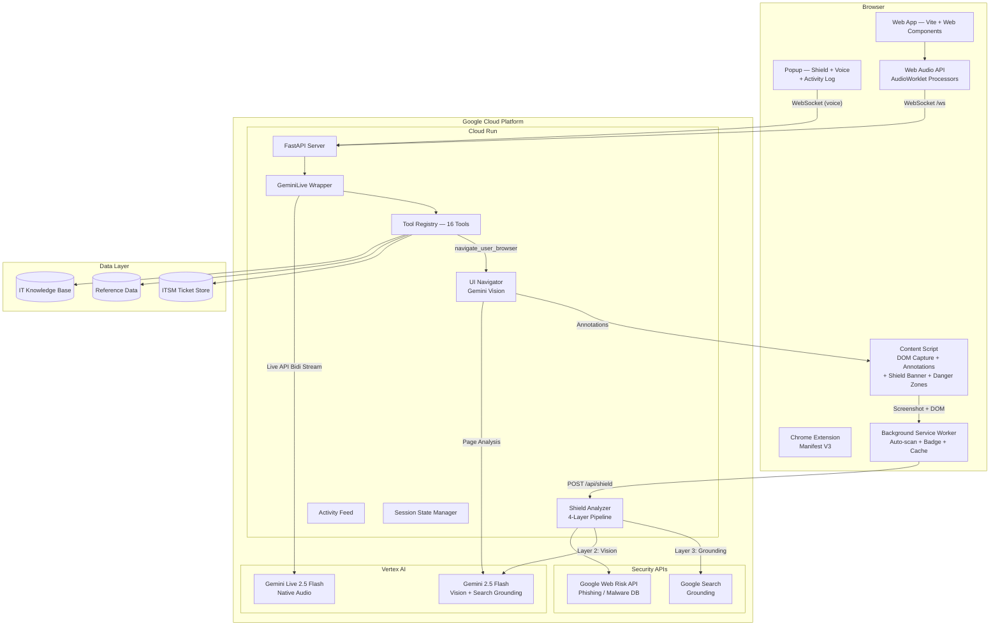
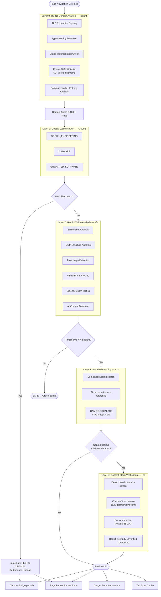
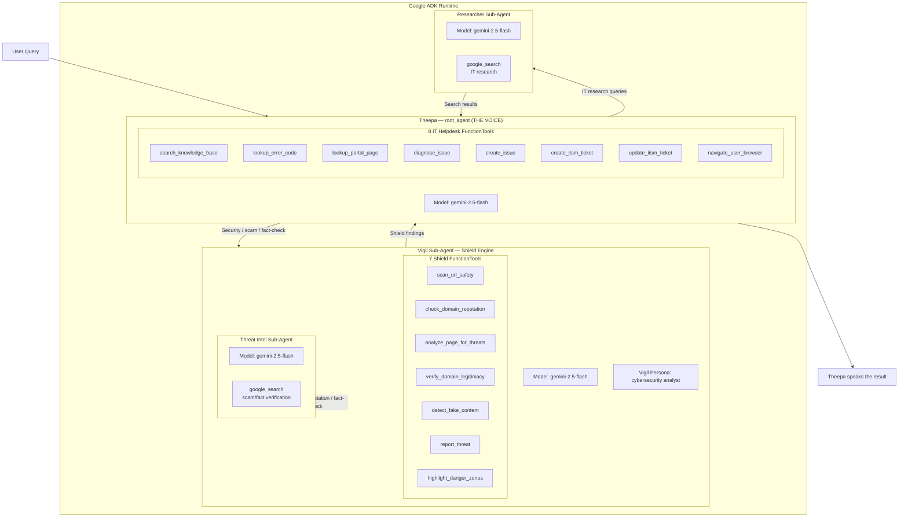
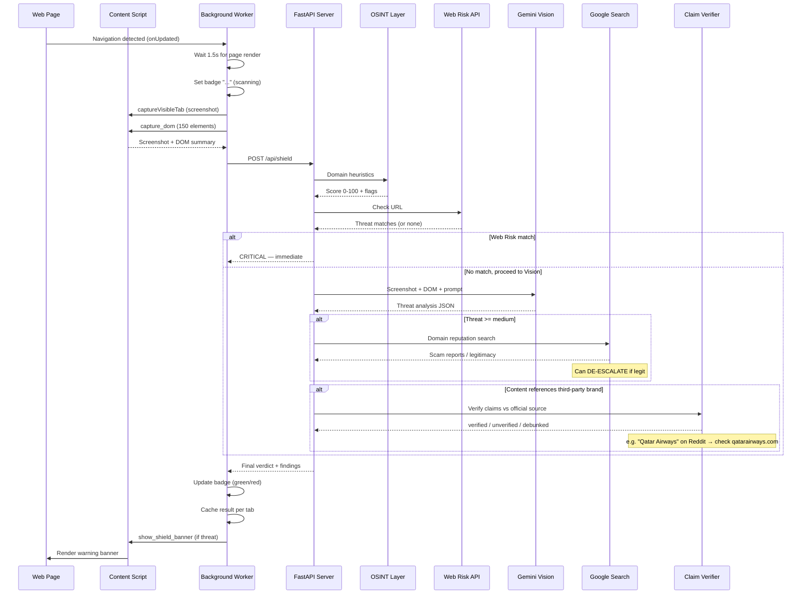
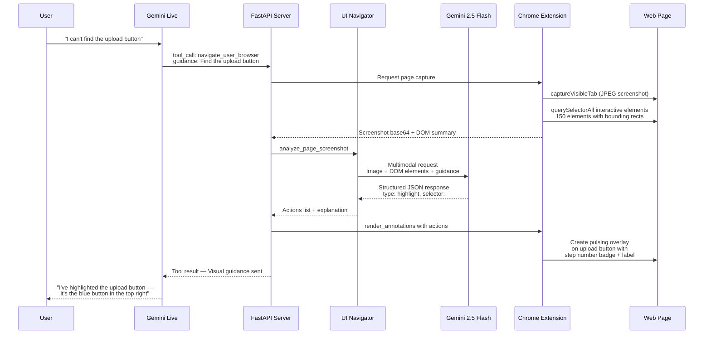
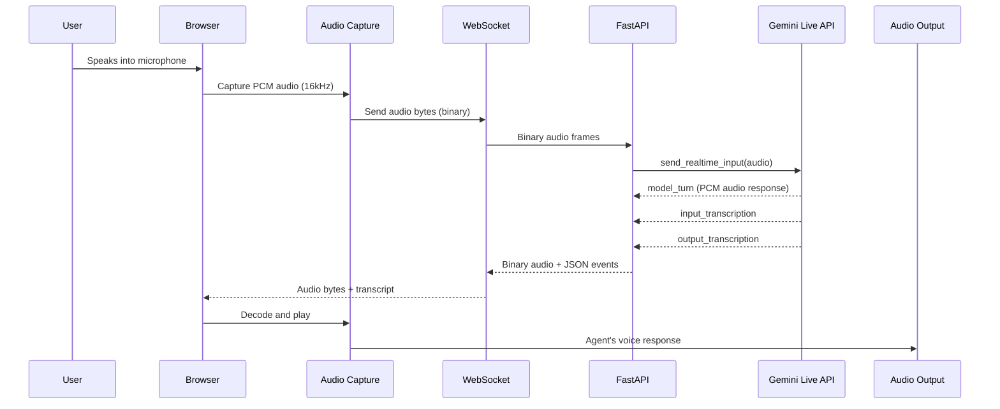
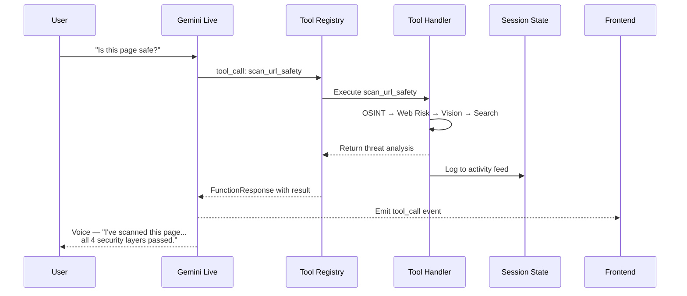
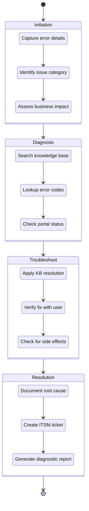
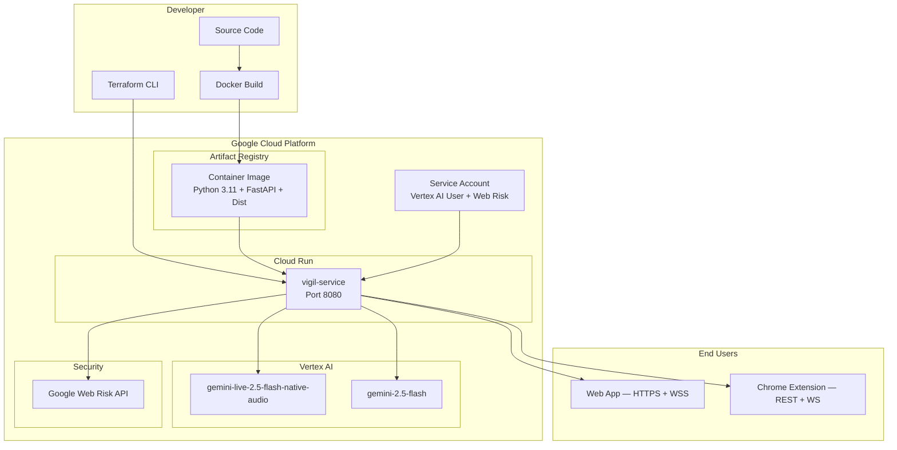
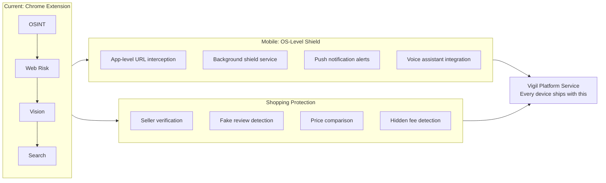

# Vigil — Architecture Diagrams

**Vigil** is an AI-powered scam shield + voice-first IT support platform. The Chrome extension silently scans every page with a 5-layer detection pipeline (OSINT + Web Risk + Gemini Vision + Google Search + Content Claim Verification). When threats are found, it warns users with banners and danger zone annotations. Voice-first IT support extends the same Gemini-powered architecture to enterprise helpdesk with 4 ADK agents and 16 tools.

---

## 1. System Architecture Overview

**Key points:**
- The Chrome extension is the **primary interface** — auto-scans every page via the shield pipeline.
- Voice sessions can be started from the extension popup or the web app.
- Shield scans use Gemini Flash (not the Live session) for vision analysis and search grounding.
- Voice-driven UI navigation flows: voice → tool call → extension → Gemini Vision → annotations.

---

## 2. Vigil Shield — 4-Layer Detection Pipeline

The core innovation. A cascading pipeline with smart gating to minimize latency for safe sites and eliminate false positives via de-escalation.

**Pipeline mechanics:**
- **Layer 0** is pure heuristic — no API calls. Known-safe whitelist prevents false positives on Google, GitHub, Amazon, etc.
- **Layer 1** catches known threats from Google's databases (~100ms).
- **Layer 2** is deep analysis — Gemini Vision examines actual page content for visual scams + deepfake/AI detection.
- **Layer 3** only triggers when Layer 2 flags something — minimizing latency for safe sites.
- **Layer 4** verifies content claims against official sources — e.g. "Qatar Airways flight disruption" on Reddit → checks qatarairways.com + Reuters/BBC/AP.
- **Smart de-escalation**: Layers 3 and 4 can LOWER the threat level if verification confirms legitimacy.

---

## 3. Google ADK Multi-Agent Architecture (4 Agents, 16 Tools)

Hierarchical multi-agent orchestration using Google's Agent Development Kit. The voice interface (Theepa) delegates to the shield engine (Vigil) for security analysis.

**Key points:**
- **4 agents**: Theepa (voice interface), Vigil (shield engine), Researcher (IT search), Threat Intel (scam search)
- **16 tools total**: 7 shield + 8 IT helpdesk + 1 google_search grounding
- ADK's `google_search` cannot coexist with other tools — requires separate sub-agents.
- Theepa is the single voice — Vigil returns structured findings, Theepa speaks them.
- Every agent transfer and tool call is logged to the activity feed.

---

## 4. Shield Scan Flow (Extension → Backend → Response)

---

## 5. Voice-Driven UI Navigation Flow

The architectural differentiator: **UI navigation is voice-driven, not text-driven**. The user speaks, the agent calls a tool, the extension captures the page, Gemini Vision analyzes it, and annotations appear on the page.

**Key points:**
- The Chrome extension has **no text input** for UI help. All navigation flows through voice.
- The content script captures up to 150 interactive elements with bounding rects, selectors, and attributes.
- Gemini Vision cross-references the screenshot with the DOM summary for precise targeting.
- Annotations include pulsing overlays, step number badges, and action labels.
- The extension can auto-execute actions: `click()`, `fill()`, `scroll()`.

---

## 6. Real-Time Voice Flow

- Audio flows as raw PCM bytes — no HTTP overhead.
- Model: `gemini-live-2.5-flash-native-audio` — native speech-to-speech.
- 20+ languages supported natively.
- Voice works from both the web app AND the Chrome extension popup.

---

## 7. Tool Orchestration Flow

---

## 8. Four-Stage Diagnostic Pipeline (IT Support)

---

## 9. Deployment Architecture

---

## 10. Future Vision — Mobile-Native Vigil

**Same pipeline, expanded surfaces — the real vision is Vigil as a platform service protecting every device.**

---

## Appendix: Technology Stack

| Layer | Technology | Purpose |
|-------|-----------|---------|
| Chrome Extension | Manifest V3, Content Scripts | Shield auto-scan, DOM capture, annotations, voice |
| Frontend | Vite, Web Components, Web Audio API | Browser UI, audio capture, system logs |
| Backend | Python 3.11, FastAPI, WebSocket, Uvicorn | API server, session management, tool orchestration |
| AI — Shield | Gemini 2.5 Flash (Vertex AI) | Vision analysis, search grounding, fake content detection |
| AI — Voice | Gemini Live 2.5 Flash Native Audio | Real-time bidirectional voice + tool calling |
| Security | Google Web Risk API | Known phishing/malware database lookup |
| ADK | Google Agent Development Kit | Multi-agent orchestration (4 agents, 16 tools) |
| Infrastructure | Cloud Run, Docker, Terraform | Containerized deployment, IaC |

---

*Vigil — 5-layer scam shield + voice-first IT support. Built solo for the Gemini Live Agent Challenge.*
