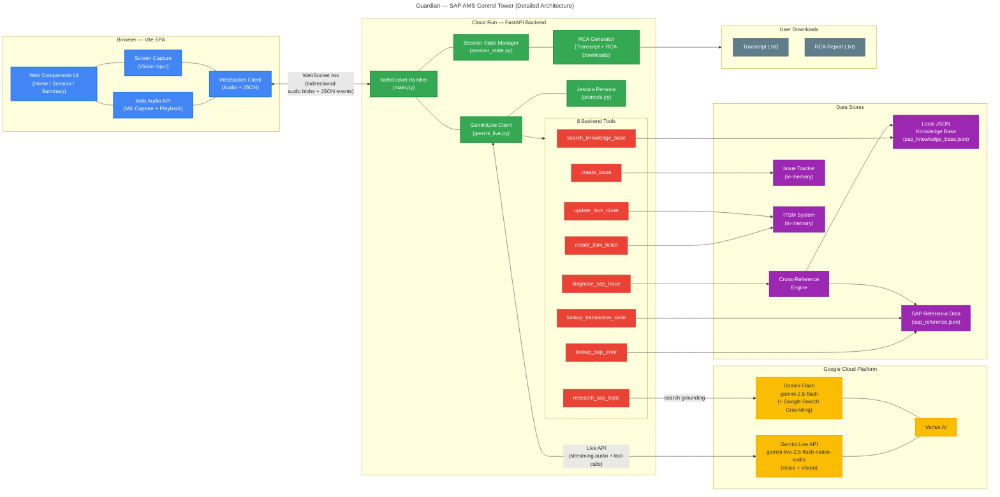
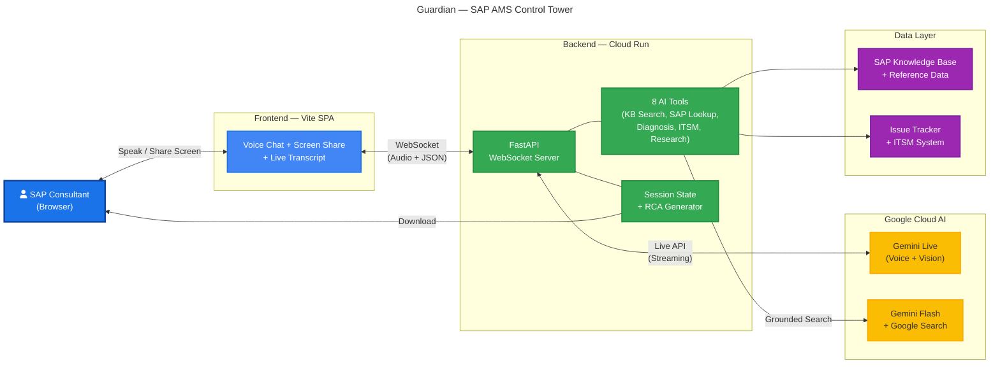

# Guardian — Architecture Diagrams

> SAP AMS Control Tower with Voice AI Agent "Jessica"

---

## 1. Detailed Architecture Diagram

---

## 2. Presentation Diagram (Demo-Friendly)

---

## Diagram Legend

| Color | Component |
|-------|-----------|
| Blue | Browser / Frontend |
| Green | Backend (FastAPI on Cloud Run) |
| Yellow | Google Cloud AI (Gemini Live, Gemini Flash) |
| Red | Backend Tools (8 function tools) |
| Purple | Data Stores (JSON KB, SAP Reference, ITSM) |
| Grey | User Downloads (Transcript, RCA Report) |

## Tool Reference

| # | Tool | Target | Purpose |
|---|------|--------|---------|
| 1 | `search_knowledge_base` | Local JSON KB | Search SAP knowledge articles |
| 2 | `lookup_sap_error` | SAP Reference Data | Look up SAP error codes |
| 3 | `lookup_transaction_code` | SAP Reference Data | Look up SAP t-codes |
| 4 | `diagnose_sap_issue` | Cross-reference engine | Cross-reference KB + errors for diagnosis |
| 5 | `create_issue` | Issue Tracker (in-memory) | Log a new issue |
| 6 | `create_itsm_ticket` | ITSM System (in-memory) | Create an ITSM ticket |
| 7 | `update_itsm_ticket` | ITSM System | Update existing ITSM ticket |
| 8 | `research_sap_topic` | Gemini Flash + Google Search | Web-grounded research on SAP topics |
