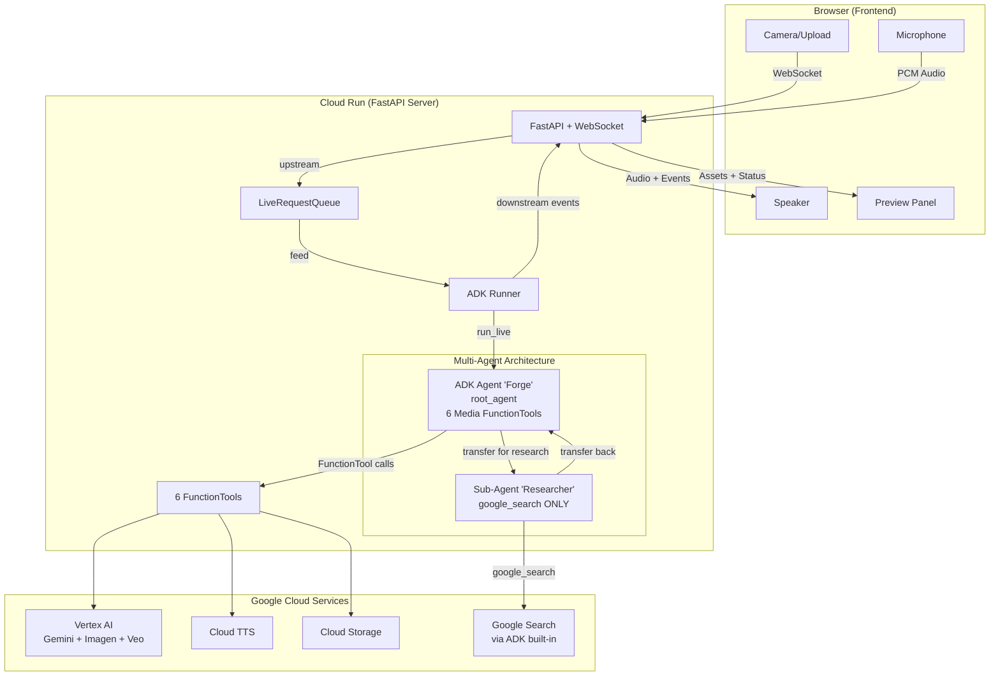
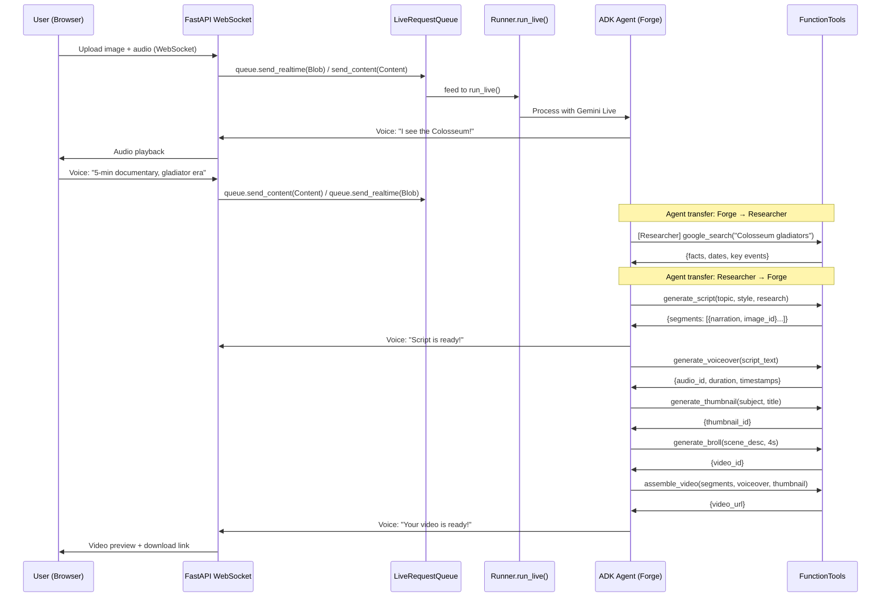
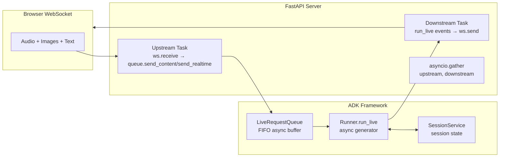
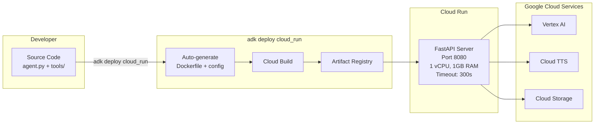

# TubeForge — Design Specification

> Kiro-style spec | Updated: 2026-02-27 | Framework: Google ADK + genmedia-live hybrid

## 1. System Architecture

### High-Level Overview



**Why multi-agent?** ADK's `google_search` built-in tool **cannot coexist** with other tools in a single agent. Forge transfers to the researcher sub-agent for fact-gathering, then resumes creative direction.

### Data Flow: Image → Video



### ADK Streaming Architecture



---

## 2. Component Breakdown

### 2.1 ADK Multi-Agent Architecture (`agent.py`)

**Framework**: Google ADK (`google-adk`)
**Pattern**: Multi-agent — researcher sub-agent (google_search) + main Forge agent (6 media FunctionTools)
**Responsibility**: AI Creative Director "Forge" — orchestrates the entire video creation pipeline

**Why multi-agent?** ADK's `google_search` tool **cannot coexist** with other tools in a single agent. This is a verified API limitation.

```python
# agent.py
import os
from google.adk.agents import Agent
from google.adk.tools import google_search
from tools.script_generator import generate_script
from tools.voiceover_gen import generate_voiceover
from tools.thumbnail_gen import generate_thumbnail
from tools.broll_gen import generate_broll
from tools.image_editor import edit_image
from tools.video_assembler import assemble_video

# Sub-agent: research ONLY (google_search cannot coexist with other tools)
researcher = Agent(
    name="researcher",
    model="gemini-2.0-flash",
    description="Research assistant that gathers facts, dates, and key information about topics",
    instruction="Research topics thoroughly using Google Search. Return key facts, dates, "
                "figures, and interesting angles. Be concise and factual.",
    tools=[google_search],  # ONLY google_search — ADK limitation
)

# Main agent: creative direction + 6 media tools
AGENT_MODEL = os.environ.get("DEMO_AGENT_MODEL", "gemini-2.0-flash-live-001")

root_agent = Agent(
    name="forge",
    model=AGENT_MODEL,
    description="AI Creative Director for YouTube explainer/documentary videos",
    instruction=open("prompts/system_prompt.txt").read(),
    tools=[
        generate_script,      # Gemini interleaved output
        generate_voiceover,   # Cloud TTS
        generate_thumbnail,   # Imagen 3
        generate_broll,       # Veo 2
        edit_image,           # Imagen edit
        assemble_video,       # FFmpeg pipeline
    ],
    sub_agents=[researcher],  # Transfer to researcher for fact-gathering
)
```

**Agent flow**: User → Forge → (transfers to Researcher for facts) → back to Forge → media tools

**Key ADK features used**:
- `Agent` class: declarative agent definition with tools list
- `sub_agents`: multi-agent transfer pattern (Forge ↔ Researcher)
- Auto-wrapped `FunctionTool`: ADK introspects type hints + docstrings to create tool schemas
- `ToolContext`: injected into tool functions for state management (`tool_context.state`)
- `google_search`: ADK built-in tool, isolated in researcher sub-agent

### 2.2 FastAPI Server (`app.py`)

**Framework**: FastAPI + WebSocket
**Pattern**: bidi-demo (from `google/adk-samples`)
**Responsibility**: WebSocket gateway between browser and ADK agent

```python
# app.py (simplified)
import asyncio
from fastapi import FastAPI, WebSocket
from fastapi.staticfiles import StaticFiles
from google.adk.runners import Runner
from google.adk.sessions import InMemorySessionService
from google.adk.agents.live_request_queue import LiveRequestQueue
from google.genai import types
from agent import root_agent

app = FastAPI()
session_service = InMemorySessionService()
runner = Runner(agent=root_agent, session_service=session_service)

@app.websocket("/ws/{user_id}/{session_id}")
async def websocket_endpoint(websocket: WebSocket, user_id: str, session_id: str):
    await websocket.accept()
    session = session_service.create_session(user_id=user_id, session_id=session_id)
    live_queue = LiveRequestQueue()

    async def upstream():
        """Client → LiveRequestQueue"""
        async for message in websocket.iter_bytes():
            # Audio: send as realtime blob
            await live_queue.send_realtime(
                types.Blob(data=message, mime_type="audio/pcm;rate=16000")
            )
        await live_queue.close()  # Graceful shutdown

    async def downstream():
        """run_live() events → Client"""
        async for event in runner.run_live(session=session, live_request_queue=live_queue):
            if event.text:
                await websocket.send_text(event.text)
            if event.audio:
                await websocket.send_bytes(event.audio)
            if event.tool_call:
                await websocket.send_json({"type": "tool_call", "name": event.tool_call.name})

    await asyncio.gather(upstream(), downstream())
```

**Correct import paths** (verified against `google-adk` package):
- `LiveRequestQueue`: `from google.adk.agents.live_request_queue import LiveRequestQueue` (NOT `google.adk.streaming`)
- `RunConfig`: `from google.adk.agents.run_config import RunConfig, StreamingMode`

**Correct LiveRequestQueue methods**:
- `queue.send_content(types.Content(...))` — for text/structured content
- `queue.send_realtime(types.Blob(...))` — for audio/video binary data
- `queue.close()` — graceful shutdown (NOT `queue.send()`)

**Static file serving**: FastAPI serves `frontend/` directory for the web UI.
**REST endpoints**: `/api/download/<file_id>` for video/image downloads.

### 2.3 Tool Modules (`tools/`)

Each tool is a plain Python function with type hints. ADK auto-wraps them as `FunctionTool`.

| Module | API Used | Input | Output | Ported From |
|--------|----------|-------|--------|-------------|
| *(researcher sub-agent)* | ADK built-in `google_search` | topic query | grounded facts | ADK native (isolated agent) |
| `script_generator.py` | Gemini interleaved output | topic, style, research | segments with images | NEW |
| `voiceover_gen.py` | Cloud TTS | script text, voice config | audio file + timestamps | NEW |
| `thumbnail_gen.py` | Imagen 3 (Vertex AI) | subject, title, style | 1280x720 PNG | genmedia-live |
| `broll_gen.py` | Veo 2 (Vertex AI) | scene description, duration | MP4 clip | genmedia-live |
| `image_editor.py` | Imagen 3 (Vertex AI) | image_id, instruction | regenerated PNG | genmedia-live |
| `video_assembler.py` | FFmpeg | segments, audio, images | final MP4 | genmedia-live |

**FunctionTool pattern**:
```python
# tools/thumbnail_gen.py
from google.adk.tools import ToolContext

def generate_thumbnail(
    subject: str,
    title_text: str,
    style: str,
    tool_context: ToolContext
) -> dict:
    """Generate a 1280x720 YouTube thumbnail using Imagen 3.

    Args:
        subject: Main subject of the thumbnail (e.g., "ancient Roman Colosseum")
        title_text: Bold text overlay for the thumbnail
        style: Visual style — "dramatic", "colorful", "mysterious", or "clean"
        tool_context: ADK tool context for state management

    Returns:
        dict with thumbnail_id and thumbnail_url
    """
    # Imagen 3 generation (ported from genmedia-live)
    from google import genai
    client = genai.Client(vertexai=True)
    response = client.models.generate_images(
        model="imagen-3.0-generate-002",
        prompt=f"{style} YouTube thumbnail: {subject}. {title_text}",
        config={"number_of_images": 1, "aspect_ratio": "16:9"},
    )
    # Save image, store in state
    image_path = save_to_outputs(response.generated_images[0], "thumbnails")
    tool_context.state["thumbnail_id"] = image_path
    return {"thumbnail_id": image_path, "thumbnail_url": f"/api/download/{image_path}"}
```

### 2.4 Frontend (`frontend/`)

**Base**: Vanilla HTML/CSS/JS (audio worklets from bidi-demo)
**Components**:
- **WebSocket client**: Connects to `/ws/{user_id}/{session_id}` (native WebSocket, not SocketIO)
- **Audio handler**: Web Audio API worklets for mic capture (PCM 16kHz) + speaker playback (from bidi-demo)
- **Camera handler**: Camera frame capture → JPEG base64 → send via WebSocket
- **Upload handler**: File picker → image resize (768x768) → send via WebSocket
- **Preview panel** (NEW): Shows generated script + scene images as they stream in
- **Progress timeline** (NEW): Visual indicator of generation stages
- **Video player** (NEW): Plays final assembled video with download button
- **Niche selector** (NEW): Buttons for content style presets

### 2.5 Asset Storage

**Local** (`outputs/`):
- `outputs/images/` — Scene images + thumbnails (PNG)
- `outputs/videos/` — B-roll clips (MP4)
- `outputs/audio/` — Voiceover files (WAV)
- `outputs/final/` — Assembled videos (MP4)

**Cloud** (GCS): Same structure mirrored to Cloud Storage bucket for production.

**ADK State** (`ToolContext.state`):
- `script_segments` — List of {narration, image_id, scene_desc}
- `voiceover_id` — Path to generated voiceover file
- `thumbnail_id` — Path to generated thumbnail
- `broll_ids` — List of B-roll clip paths
- `video_url` — Path to final assembled video
- `niche` — Selected content niche preset
- `research_context` — Google Search results for grounding

---

## 3. API Contracts

### 3.1 WebSocket Protocol

**Endpoint**: `ws://host/ws/{user_id}/{session_id}`

**Client → Server (upstream via LiveRequestQueue — `send_content()` / `send_realtime()`)**:

| Message Type | Format | Description |
|-------------|--------|-------------|
| Audio | Binary (PCM 16kHz Int16) | Streaming mic audio |
| Text | JSON `{"type": "text", "content": "..."}` | Text message |
| Image | JSON `{"type": "image", "data": "base64_jpeg"}` | Photo upload |
| Camera frame | JSON `{"type": "frame", "data": "base64_jpeg"}` | Live camera (every 2s) |

**Server → Client (downstream from run_live events)**:

| Event Type | Format | Description |
|-----------|--------|-------------|
| Audio | Binary (PCM 24kHz) | Forge voice response |
| Text | JSON `{"type": "text", "content": "..."}` | Text response |
| Tool started | JSON `{"type": "tool_start", "name": "..."}` | Tool execution began |
| Tool result | JSON `{"type": "tool_result", "name": "...", "url": "..."}` | Tool produced output |
| Script segment | JSON `{"type": "segment", "index": N, "narration": "...", "image_url": "..."}` | Streaming script |
| Progress | JSON `{"type": "progress", "stage": "...", "percent": N}` | Pipeline progress |
| Video ready | JSON `{"type": "video_ready", "url": "...", "thumbnail_url": "..."}` | Final video |
| Error | JSON `{"type": "error", "message": "...", "recoverable": bool}` | Error |

### 3.2 REST Endpoints

| Route | Method | Description |
|-------|--------|-------------|
| `/` | GET | Serve frontend (static files) |
| `/api/download/{file_id}` | GET | Download generated asset (video/image/audio) |
| `/api/assets` | GET | List generated assets for current session |
| `/api/health` | GET | Health check for Cloud Run |

---

## 4. Tech Decisions

| Decision | Choice | Rationale |
|----------|--------|-----------|
| **Agent Framework** | Google ADK (`google-adk`) | Purpose-built for agents. Hackathon is "Agent Challenge" — ADK shows proper agent architecture. Built-in `run_live()`, FunctionTool auto-wrapping, `adk deploy`, `adk web`. |
| **Web Framework** | FastAPI + WebSocket | ADK bidi-demo uses FastAPI. Native async. Better WebSocket support than Flask-SocketIO. |
| **SDK** | ADK wraps `google-genai` internally | ADK adds: tools framework, session management, evaluation. We don't use genai directly. |
| **Streaming** | `LiveRequestQueue` + `run_live()` | ADK's native bidi streaming pattern. Decouples client input from agent processing. |
| **Image model** | Imagen 3 via Vertex AI | Best quality. Ported from genmedia-live's proven pattern. |
| **Video model** | Veo 2/3.1 via Vertex AI | Only option for AI video gen in Google Cloud. Ported from genmedia-live. |
| **TTS** | Google Cloud TTS (Neural2/Studio) | Native GCP service (hackathon bonus). Word-level timestamps for subtitles. |
| **Video assembly** | FFmpeg | Industry standard. Ported from genmedia-live. Ken Burns, subtitles, audio mixing. |
| **Frontend** | Vanilla HTML/CSS/JS | No build step. Audio worklets from bidi-demo. Fast iteration. |
| **Search** | ADK built-in `google_search` (in researcher sub-agent) | Zero-config. Isolated in sub-agent due to ADK limitation: cannot coexist with other tools. |
| **Deployment** | `adk deploy cloud_run` | One-command deploy. No Dockerfile needed. Auto-generates container. |
| **Dev Testing** | `adk web` | Free built-in dev UI for testing agent responses during development. |
| **Auth** | Vertex AI via ADK env vars | ADK reads `GOOGLE_CLOUD_PROJECT` and `GOOGLE_CLOUD_LOCATION`. Proves GCP usage. |

---

## 5. Error Handling Strategy

| Error | Handling | Fallback |
|-------|---------|----------|
| WebSocket disconnect | Client auto-reconnect with exponential backoff | Show reconnecting indicator |
| LiveRequestQueue close | `await live_queue.close()` for graceful shutdown | Log warning, create new session |
| Gemini Live session expires | ADK session resumption via `RunConfig` | Create new session, notify user |
| Imagen generation fails | Retry once with simplified prompt | Use placeholder image, continue pipeline |
| Veo generation fails | Retry once | Skip B-roll, use Ken Burns on static image |
| Cloud TTS fails | Retry with different voice | Return error, user can retry |
| FFmpeg assembly fails | Log error, retry with simpler config | Return individual assets |
| Google Search fails | Generate script without grounding | Add disclaimer about fact-checking |
| Tool function exception | ADK catches and returns error to agent | Agent informs user, suggests retry |

---

## 6. Environment & Configuration

### Environment Variables

```env
# Google Cloud (read by ADK automatically)
GOOGLE_CLOUD_PROJECT=tubeforge-hackathon
GOOGLE_CLOUD_LOCATION=us-central1

# ADK Agent
GOOGLE_GENAI_USE_VERTEXAI=TRUE

# Cloud TTS
TTS_DEFAULT_VOICE=en-US-Neural2-D
TTS_SPEAKING_RATE=0.95

# Cloud Storage
GCS_BUCKET=tubeforge-assets

# Server
PORT=8080
HOST=0.0.0.0

# FFmpeg
FFMPEG_PATH=/usr/bin/ffmpeg
```

### GCP APIs to Enable
- `aiplatform.googleapis.com` (Vertex AI — Gemini, Imagen, Veo)
- `run.googleapis.com` (Cloud Run)
- `storage.googleapis.com` (Cloud Storage)
- `texttospeech.googleapis.com` (Cloud TTS)
- `cloudbuild.googleapis.com` (Cloud Build — for adk deploy)
- `artifactregistry.googleapis.com` (Artifact Registry — for adk deploy)
- `secretmanager.googleapis.com` (Secret Manager — for adk deploy)

---

## 7. Project Structure

```
tubeforge/
├── agent.py                   # ADK Agent with root_agent definition
├── __init__.py                # from . import agent
├── app.py                     # FastAPI + WebSocket server (bidi-demo pattern)
├── tools/
│   ├── __init__.py
│   ├── script_generator.py    # Gemini interleaved output (NEW)
│   ├── thumbnail_gen.py       # Imagen 3 (ported from genmedia-live)
│   ├── broll_gen.py           # Veo 2 (ported from genmedia-live)
│   ├── voiceover_gen.py       # Cloud TTS (NEW)
│   ├── video_assembler.py     # FFmpeg pipeline (ported from genmedia-live)
│   └── image_editor.py        # Imagen edit (ported from genmedia-live)
├── prompts/
│   ├── system_prompt.txt      # Forge persona
│   └── niche_presets.json     # Style configs per content type
├── frontend/
│   ├── index.html             # Main UI
│   ├── style.css              # Dark theme styling
│   └── src/
│       ├── main.js            # App logic + WebSocket client
│       ├── audio.js           # Web Audio API worklets (from bidi-demo)
│       └── ui.js              # Preview panel, progress, video player
├── outputs/                   # Generated assets (.gitignore)
│   ├── images/
│   ├── videos/
│   ├── audio/
│   └── final/
├── terraform/
│   └── main.tf               # IaC (bonus points)
├── requirements.txt           # google-adk, fastapi, uvicorn, google-cloud-texttospeech, pillow
├── .env.example
└── README.md                  # Spin-up instructions
```

---

## 8. Deployment Architecture



**Deploy command**:
```bash
adk deploy cloud_run \
  --project=tubeforge-hackathon \
  --region=us-central1 \
  --with_ui \
  tubeforge/
```

**Cloud Run Configuration** (auto-configured by ADK):
- Memory: 1GB (FFmpeg needs headroom)
- CPU: 1 vCPU
- Request timeout: 300s (video assembly takes time)
- Min instances: 0 (scale to zero)
- Max instances: 1 (hackathon)
- Allow unauthenticated (demo access)

---

## 9. Google Cloud Services (5 total)

1. **Vertex AI** — Gemini 2.0 Flash Live (`gemini-2.0-flash-live-001`) for agent, Imagen 3 for images, Veo 2 for video
2. **Cloud Run** — Backend hosting via `adk deploy cloud_run`
3. **Cloud Storage** — Generated asset storage (images, audio, video)
4. **Cloud Text-to-Speech** — AI voiceover with word timestamps
5. **Google Search** — Topic research/grounding via ADK built-in tool (in researcher sub-agent)
