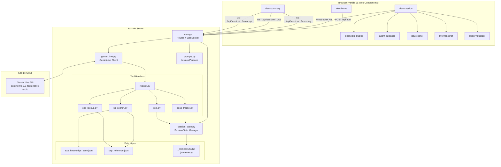
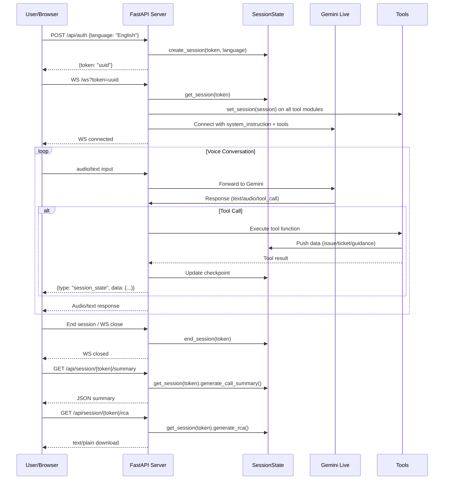
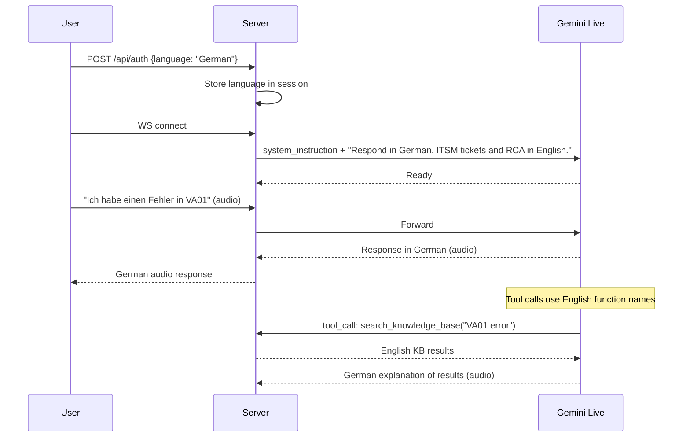

# Guardian — Design Specification

> **Format**: Kiro IDE-style | **Version**: 1.0 | **Date**: 2026-03-08
> **Product**: Guardian — SAP AMS Control Tower
> **Status**: Phase 0 complete, Phases 1–6 pending

---

## 1. Architecture Overview



---

## 2. Component Breakdown

### 2.1 SessionState Backend (`server/session_state.py`)

**Dataclasses**:

```python
@dataclass
class DiagnosticCheckpoint:
    stage: str           # "initiation" | "diagnosis" | "troubleshoot" | "resolution"
    label: str           # Human-readable checkpoint name
    status: str          # "pending" | "active" | "complete" | "skipped"
    timestamp: str       # ISO 8601 when status last changed
    detail: str          # Optional context (e.g., "Error V1321 captured")

@dataclass
class TranscriptEntry:
    speaker: str         # "user" | "jessica"
    text: str
    timestamp: str       # ISO 8601

@dataclass
class SessionState:
    session_id: str      # Same as auth token (UUID)
    token: str
    language: str        # Default "English"
    module: str          # SAP module (SD, MM, FI, etc.) — set during triage
    priority: str        # "low" | "medium" | "high" | "critical"
    stage: str           # Current diagnostic stage
    checkpoints: list[DiagnosticCheckpoint]
    transcript: list[TranscriptEntry]
    issues: list[dict]   # From issue_tracker tool calls
    tickets: list[dict]  # From itsm tool calls
    agent_guidance: list[dict]  # {title: str, detail: str}
    start_time: str      # ISO 8601
    end_time: str | None # ISO 8601 or None if active
    active: bool         # True while session is live
```

**Default Checkpoints** (initialized on session creation):

| Stage | Checkpoints |
|-------|-------------|
| `initiation` | Capture error details, Identify SAP module, Assess business impact |
| `diagnosis` | Search knowledge base, Lookup error codes, Run diagnostic T-codes |
| `troubleshoot` | Apply KB resolution, Verify fix with user, Check for side effects |
| `resolution` | Document root cause, Create ITSM ticket, Generate RCA report, Provide L2 guidance |

**Store Functions**:

```python
_SESSIONS: dict[str, SessionState] = {}

def create_session(token: str, language: str = "English") -> SessionState: ...
def get_session(token: str) -> SessionState | None: ...
def end_session(token: str) -> SessionState | None: ...
```

**Report Generation Methods** (on `SessionState`):

```python
def generate_rca(self) -> str:
    """Generate plain-text Root Cause Analysis report.

    Sections:
    - Incident Summary (module, priority, duration)
    - Timeline (checkpoint timestamps)
    - Issues Detected (from self.issues)
    - Root Cause (from completed diagnosis checkpoints)
    - Resolution Steps (from troubleshoot checkpoints)
    - Preventive Actions (from agent_guidance)
    - ITSM Tickets (from self.tickets)
    """

def generate_transcript_export(self) -> str:
    """Generate plain-text transcript.

    Format per line:
    [HH:MM:SS] SPEAKER: text
    """

def generate_call_summary(self) -> dict:
    """Generate JSON-serializable summary.

    Returns: {
        session_id, language, module, priority, stage,
        duration_seconds, start_time, end_time,
        checkpoints: [{stage, label, status, timestamp, detail}],
        issues: [...],
        tickets: [...],
        agent_guidance: [...],
        transcript_length: int
    }
    """
```

---

### 2.2 Session API Routes (additions to `server/main.py`)

Added to existing FastAPI app:

```python
@app.get("/api/session/{token}/summary")
async def get_session_summary(token: str) -> JSONResponse:
    """Return structured session summary as JSON."""

@app.get("/api/session/{token}/rca")
async def get_session_rca(token: str) -> PlainTextResponse:
    """Return RCA report as downloadable text file."""

@app.get("/api/session/{token}/transcript")
async def get_session_transcript(token: str) -> PlainTextResponse:
    """Return transcript as downloadable text file."""
```

**Wiring into existing routes**:

| Existing Route | Change |
|----------------|--------|
| `POST /api/auth` | After generating token, call `create_session(token, language)` |
| `WS /ws` | On connect: `session = get_session(token)`. On close: `end_session(token)` |
| Tool calls | Each tool pushes data into session (issues, tickets, guidance) |

---

### 2.3 WebSocket Protocol Extension

**New event type**: `session_state`

Emitted by server whenever session state changes (stage advance, checkpoint update, guidance added).

```json
{
  "type": "session_state",
  "data": {
    "stage": "diagnosis",
    "checkpoints": [
      {
        "stage": "initiation",
        "label": "Capture error details",
        "status": "complete",
        "timestamp": "2026-03-08T14:30:00Z",
        "detail": "Error V1321 in VA01"
      }
    ],
    "agent_guidance": [
      {
        "title": "Check condition records",
        "detail": "Run VK13 to verify pricing condition records for the material/customer combination."
      }
    ],
    "issues": [...],
    "tickets": [...]
  }
}
```

**Emission points** (server-side, in WebSocket handler):

1. After any tool call completes → emit full `session_state`
2. After `advance_stage()` is called → emit
3. After `update_checkpoint()` is called → emit

**Implementation**: Helper function in `main.py`:

```python
async def emit_session_state(websocket: WebSocket, session: SessionState):
    """Send current session state to client."""
    await websocket.send_json({
        "type": "session_state",
        "data": session.generate_call_summary()
    })
```

---

### 2.4 Tool ↔ Session Wiring

Each tool file uses a module-level session reference:

```python
# In each tool file (issue_tracker.py, itsm.py, etc.)
_current_session: SessionState | None = None

def set_session(session: SessionState):
    global _current_session
    _current_session = session
```

**Tool-specific wiring**:

| Tool File | Session Integration |
|-----------|-------------------|
| `issue_tracker.py` | `create_issue()` → appends to `_current_session.issues` |
| `itsm.py` | `create_itsm_ticket()` → appends to `_current_session.tickets` |
| `itsm.py` | `update_itsm_ticket()` → updates matching ticket in `_current_session.tickets` |
| `kb_search.py` | `search_knowledge_base()` → advances checkpoint "Search knowledge base" to complete |
| `sap_lookup.py` | `lookup_sap_error()` → advances checkpoint "Lookup error codes" to complete |

**In `main.py` WebSocket handler** (on connect):

```python
session = get_session(token)
if session:
    # Wire session into all tool modules
    from server.tools import issue_tracker, itsm, kb_search, sap_lookup
    issue_tracker.set_session(session)
    itsm.set_session(session)
    kb_search.set_session(session)
    sap_lookup.set_session(session)
```

---

### 2.5 Frontend Components (3 new)

#### 2.5.1 `<diagnostic-tracker>` (`frontend/src/components/diagnostic-tracker.js`)

```
┌─────────────────────────────────────────────────────┐
│  DIAGNOSTIC PROGRESS                                │
│                                                     │
│  ● Initiation ──── ◉ Diagnosis ──── ○ Troubleshoot ──── ○ Resolution │
│                                                     │
│  ▼ Diagnosis (active)                               │
│    ✓ Search knowledge base                          │
│    ◉ Lookup error codes                             │
│    ○ Run diagnostic T-codes                         │
└─────────────────────────────────────────────────────┘
```

**Shadow DOM**: Yes — encapsulated styles
**CSS Variables**: `--guardian-accent`, `--guardian-bg`, `--guardian-text`, `--guardian-success`, `--guardian-warning`
**Public API**:
- `updateFromState(state)` — accepts `{stage, checkpoints}` object, re-renders pipeline and checkpoint list

#### 2.5.2 `<agent-guidance>` (`frontend/src/components/agent-guidance.js`)

```
┌─────────────────────────────────────────────────────┐
│  L2 GUIDANCE                                        │
│                                                     │
│  ┌───────────────────────────────────────────────┐  │
│  │ Check condition records                   [📋] │  │
│  │ Run VK13 to verify pricing condition...       │  │
│  └───────────────────────────────────────────────┘  │
│  ┌───────────────────────────────────────────────┐  │
│  │ Verify pricing procedure              [📋]    │  │
│  │ Check OVKK assignment for sales org...        │  │
│  └───────────────────────────────────────────────┘  │
└─────────────────────────────────────────────────────┘
```

**Shadow DOM**: Yes
**Public API**:
- `setGuidance(items)` — replaces all guidance with `[{title, detail}]`
- `addGuidance(item)` — appends single `{title, detail}`
**Behavior**: Hidden (`display: none`) when items array is empty

#### 2.5.3 `<view-summary>` (`frontend/src/components/view-summary.js`)

```
┌──────────────────────────────────────────────────────────┐
│  SESSION SUMMARY                                         │
│                                                          │
│  Duration: 4m 32s | Module: SD | Priority: High          │
│  Language: English | Started: 14:30:00                    │
│                                                          │
│  ┌── Diagnostic Pipeline ─────────────────────────────┐  │
│  │  ● Initiation ── ● Diagnosis ── ● Troubleshoot ── ○ Resolution │
│  └────────────────────────────────────────────────────┘  │
│                                                          │
│  Issues Detected (2)                                     │
│  ┌─────────────────────────────────────────────────────┐ │
│  │ 🔴 Pricing condition missing in VA01                │ │
│  │ 🟡 Variant drift on ZVA01 custom T-code             │ │
│  └─────────────────────────────────────────────────────┘ │
│                                                          │
│  ITSM Ticket                                             │
│  ┌─────────────────────────────────────────────────────┐ │
│  │ INC00000042 | Pricing Error V1321 | HIGH | Open     │ │
│  └─────────────────────────────────────────────────────┘ │
│                                                          │
│  L2 Guidance                                             │
│  ┌─────────────────────────────────────────────────────┐ │
│  │ • Check condition records in VK13                   │ │
│  │ • Verify pricing procedure in OVKK                  │ │
│  └─────────────────────────────────────────────────────┘ │
│                                                          │
│  [📥 Download RCA Report]  [📥 Download Transcript]      │
│  [🏠 New Session]                                        │
└──────────────────────────────────────────────────────────┘
```

**Shadow DOM**: Yes
**Lifecycle**:
1. On mount: extract `token` from navigation event detail
2. Fetch `GET /api/session/{token}/summary`
3. Render session data
4. Download buttons fetch respective endpoints and trigger browser download

---

### 2.6 View-Session Layout Restructure

**Current layout** (`view-session.js`):
```
┌───────────────────────────────────────┐
│ Header (title, status, end button)    │
├──────────────────┬────────────────────┤
│ Transcript +     │ Issue Panel        │
│ Audio Visualizer │                    │
│                  │                    │
└──────────────────┴────────────────────┘
```

**New layout**:
```
┌───────────────────────────────────────────────┐
│ Header (title, status, language badge, end)    │
├──────────────────┬────────────────────────────┤
│ Transcript +     │ Diagnostic Tracker          │
│ Audio Visualizer │ ─────────────────────────── │
│                  │ Agent Guidance               │
│                  │ ─────────────────────────── │
│                  │ Issue Panel                  │
│ [input area]     │ (scrollable)                │
└──────────────────┴────────────────────────────┘
```

**Changes**:
- Right panel becomes a scrollable container with 3 stacked components
- Language badge (read-only) added to header showing session language
- Session token stored as `this.sessionToken` for summary navigation
- "End Session" triggers navigation to summary view with token

---

### 2.7 App-Root Navigation Extension

**Current view switch** (`app-root.js`):
```javascript
switch (this.state.view) {
    case 'home': return '<view-home>';
    case 'session': return '<view-session>';
}
```

**New view switch**:
```javascript
switch (this.state.view) {
    case 'home': return '<view-home>';
    case 'session': return '<view-session>';
    case 'summary': return '<view-summary>';
}
```

**Navigation event**: `navigate` custom event with `detail: { view, token }`

---

## 3. API Contracts

### Session Summary

| Field | Value |
|-------|-------|
| **Method** | `GET` |
| **Path** | `/api/session/{token}/summary` |
| **Request** | Path parameter: `token` (UUID string) |
| **Response (200)** | `application/json` |
| **Response (404)** | `{"error": "Session not found"}` |

**Response Body (200)**:
```json
{
  "session_id": "uuid-string",
  "language": "English",
  "module": "SD",
  "priority": "high",
  "stage": "resolution",
  "duration_seconds": 272,
  "start_time": "2026-03-08T14:30:00Z",
  "end_time": "2026-03-08T14:34:32Z",
  "checkpoints": [
    {
      "stage": "initiation",
      "label": "Capture error details",
      "status": "complete",
      "timestamp": "2026-03-08T14:30:15Z",
      "detail": "Error V1321 in VA01"
    }
  ],
  "issues": [
    {
      "id": "ISS-001",
      "title": "Pricing condition missing",
      "severity": "high",
      "transaction_code": "VA01"
    }
  ],
  "tickets": [
    {
      "ticket_id": "INC00000042",
      "title": "Pricing Error V1321 in VA01",
      "severity": "high",
      "status": "open"
    }
  ],
  "agent_guidance": [
    {
      "title": "Check condition records",
      "detail": "Run VK13 to verify pricing condition records."
    }
  ],
  "transcript_length": 45
}
```

### RCA Report Download

| Field | Value |
|-------|-------|
| **Method** | `GET` |
| **Path** | `/api/session/{token}/rca` |
| **Request** | Path parameter: `token` (UUID string) |
| **Response (200)** | `text/plain` with `Content-Disposition: attachment; filename="guardian-rca-{token[:8]}.txt"` |
| **Response (404)** | `{"error": "Session not found"}` |

### Transcript Download

| Field | Value |
|-------|-------|
| **Method** | `GET` |
| **Path** | `/api/session/{token}/transcript` |
| **Request** | Path parameter: `token` (UUID string) |
| **Response (200)** | `text/plain` with `Content-Disposition: attachment; filename="guardian-transcript-{token[:8]}.txt"` |
| **Response (404)** | `{"error": "Session not found"}` |

### Auth (Modified)

| Field | Value |
|-------|-------|
| **Method** | `POST` |
| **Path** | `/api/auth` |
| **Request Body** | `{"language": "English"}` (optional, defaults to "English") |
| **Response (200)** | `{"token": "uuid-string"}` |

---

## 4. Data Flow

### 4.1 Session Lifecycle



### 4.2 Multi-Language Flow



---

## 5. Technology Decisions

| Decision | Choice | Rationale |
|----------|--------|-----------|
| Session storage | In-memory dict | Hackathon scope — no persistence needed |
| Frontend framework | Vanilla Web Components | Consistent with existing Phase 0 components |
| Shadow DOM | Yes for new components | Style encapsulation, no CSS conflicts |
| Report format | Plain text | Simple, universally downloadable, no dependencies |
| Language handling | System instruction prefix | Gemini natively supports multilingual; instruction is sufficient |
| State emission | Full state on each event | Simpler than delta-based updates; state is small |
| Checkpoint management | Server-driven | Tools know when checkpoints complete; frontend is display-only |

---

## 6. Error Handling

| Scenario | Handling |
|----------|----------|
| Session not found (API) | Return 404 with `{"error": "Session not found"}` |
| Session still active (RCA/transcript) | Return available data (partial RCA is acceptable) |
| WebSocket drops unexpectedly | `end_session()` called in `finally` block; session data preserved |
| Tool call fails | Tool returns error string; session state unchanged; checkpoint not advanced |
| Download fetch fails (frontend) | Show error toast; retry button |
| Gemini API error | Existing error handling in `gemini_live.py`; session state preserved |
| Clipboard copy fails | Fallback: select text in textarea; show "Copy failed" message |
