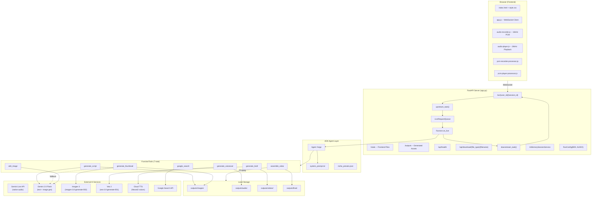
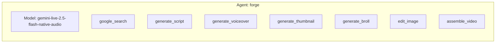
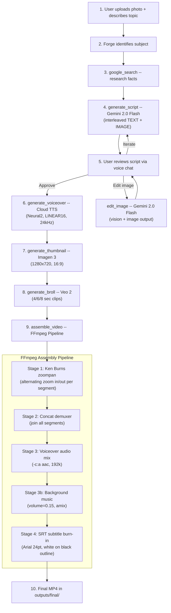
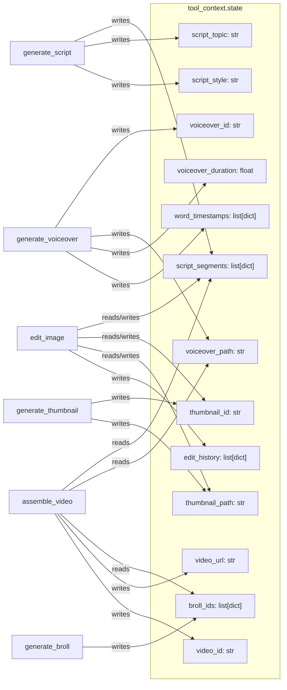
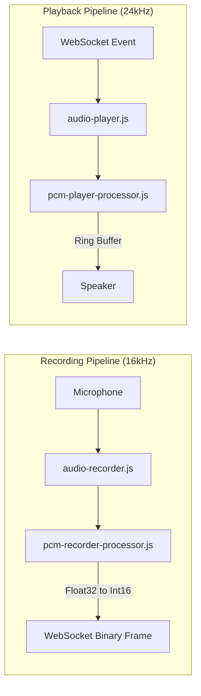
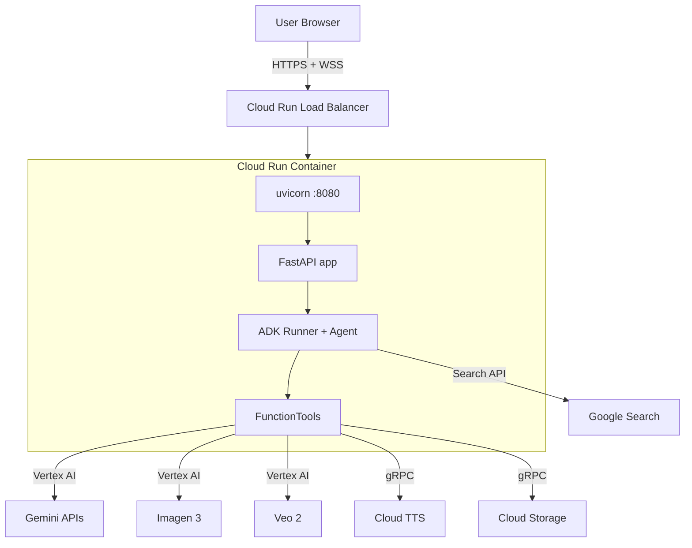

# TubeForge -- Design Document

**Version**: 1.0
**Date**: 2026-03-02
**Author**: KaarTech UK (Solo)
**Status**: Implementation Complete
**Hackathon**: Gemini Live Agent Challenge (Devpost)

---

## Table of Contents

1. [Overview](#1-overview)
2. [System Architecture](#2-system-architecture)
3. [Component Details](#3-component-details)
4. [Data Flow](#4-data-flow)
5. [API Contracts](#5-api-contracts)
6. [Tool Specifications](#6-tool-specifications)
7. [Session State Schema](#7-session-state-schema)
8. [Frontend Architecture](#8-frontend-architecture)
9. [Output Directory Structure](#9-output-directory-structure)
10. [Deployment Architecture](#10-deployment-architecture)
11. [Configuration and Environment](#11-configuration-and-environment)
12. [Dependencies](#12-dependencies)
13. [Key Design Decisions](#13-key-design-decisions)

---

## 1. Overview

TubeForge is an AI-powered explainer video engine. A user uploads a photo, has a real-time voice conversation with an AI Creative Director named "Forge", and receives a complete YouTube-ready explainer video. The system uses Google ADK for agent orchestration, Gemini Live API for bidirectional voice streaming, and a suite of generative AI models (Imagen 3, Veo 2, Cloud TTS) exposed as ADK FunctionTools.

### Core Concept

```
Photo Upload --> Voice Conversation with Forge --> Complete YouTube Video
```

### Tech Stack Summary

| Layer | Technology |
|-------|-----------|
| Agent Framework | Google ADK (`google-adk`) |
| Conversation Model | `gemini-live-2.5-flash-native-audio` (Gemini Live API) |
| Script Generation | `gemini-2.0-flash` (interleaved TEXT + IMAGE) |
| Image Generation | Imagen 3 (`imagen-3.0-generate-002`) via Vertex AI |
| Video Generation | Veo 2 (`veo-2.0-generate-001`) via Vertex AI |
| Image Editing | `gemini-2.0-flash` (multimodal vision + image output) |
| Voiceover | Google Cloud Text-to-Speech (Neural2 voices) |
| Video Assembly | FFmpeg (Ken Burns, concat, subtitles, audio mixing) |
| Web Search | ADK built-in `google_search` |
| Server | FastAPI + WebSocket (uvicorn) |
| Deployment | Docker / Cloud Run via `adk deploy cloud_run` |

---

## 2. System Architecture

### 2.1 High-Level Architecture Diagram



### 2.2 Single Agent Architecture

TubeForge uses a single ADK Agent with all 7 tools. This is a deliberate simplification from the original multi-agent design (with a separate researcher sub-agent for `google_search`). The decision was made because:

1. `google_search` CAN coexist with FunctionTools in a single agent (verified empirically).
2. Sub-agent transfers open extra bidirectional sessions, causing resource exhaustion under the Live API.
3. The single-agent pattern matches the proven bidi-demo reference implementation.



---

## 3. Component Details

### 3.1 Server -- `app.py`

The server is a direct adaptation of the [google/adk-samples bidi-demo](https://github.com/google/adk-samples/tree/main/python/agents/bidi-demo) `main.py`.

**Responsibilities:**
- Serve the frontend as static files
- Expose the outputs directory for asset access
- Manage WebSocket connections for bidirectional streaming
- Bridge browser audio/text/image to ADK's `LiveRequestQueue`
- Bridge ADK events back to the browser

**Key Classes and Configuration:**
- `InMemorySessionService` -- stores session state in memory (no persistence)
- `Runner` -- ADK runner bound to the `root_agent`
- `RunConfig` with:
  - `StreamingMode.BIDI` -- bidirectional streaming
  - `response_modalities=["AUDIO"]` -- native audio output for voice conversation
  - `AudioTranscriptionConfig()` -- enables both input and output audio transcription
  - `SessionResumptionConfig()` -- supports session resumption on reconnect
- If the model name does not contain `native-audio`, falls back to `response_modalities=["TEXT"]`

**Concurrency Model:**
```python
asyncio.gather(upstream_task(), downstream_task())
```
Two coroutines run in parallel per WebSocket connection:
- `upstream_task`: reads from WebSocket, writes to `LiveRequestQueue`
- `downstream_task`: reads from `runner.run_live()`, writes to WebSocket

### 3.2 Agent -- `agent.py`

A single ADK `Agent` instance exported as `root_agent`.

| Property | Value |
|----------|-------|
| `name` | `"forge"` |
| `model` | `gemini-live-2.5-flash-native-audio` (via `DEMO_AGENT_MODEL` env var) |
| `description` | AI Creative Director for YouTube explainer and documentary videos |
| `instruction` | Loaded from `prompts/system_prompt.txt` with inline fallback |
| `tools` | 7 total: `google_search`, `generate_script`, `generate_voiceover`, `generate_thumbnail`, `generate_broll`, `edit_image`, `assemble_video` |
| `sub_agents` | None (single agent architecture) |

### 3.3 System Prompt -- `prompts/system_prompt.txt`

Defines the Forge persona:
- Identifies subjects in uploaded images
- Researches topics via `google_search` before writing scripts
- Guides users through a creative workflow (identify, research, script, review, produce)
- Personality: creative, enthusiastic, calls the user "creator"
- Rules: real facts only, 130-150 WPM narration pace, hook in first 10 seconds

### 3.4 Niche Presets -- `prompts/niche_presets.json`

Pre-configured style profiles for different video types:

| Preset | Voice | Rate | Visual Mood |
|--------|-------|------|-------------|
| `documentary` | en-US-Neural2-D | 0.92 | cinematic, dramatic lighting |
| `facts` | en-US-Neural2-J | 1.05 | bright, clean, infographic |
| `story` | en-US-Neural2-D | 0.95 | warm, narrative, storybook |
| `explainer` | en-US-Neural2-J | 1.00 | clean, professional, educational |
| `horror` | en-US-Neural2-A | 0.88 | dark, eerie, desaturated |
| `history` | en-US-Neural2-D | 0.93 | aged, sepia, period-accurate |

---

## 4. Data Flow

### 4.1 End-to-End Data Flow Diagram

```mermaid
sequenceDiagram
    participant U as User (Browser)
    participant WS as WebSocket (app.py)
    participant UP as upstream_task
    participant LRQ as LiveRequestQueue
    participant RUN as Runner.run_live()
    participant LIVE as Gemini Live API
    participant TOOLS as FunctionTools
    participant DOWN as downstream_task

    U->>WS: Connect /ws/{user_id}/{session_id}
    WS->>WS: Accept, create session, create LRQ

    par upstream + downstream
        loop Client Messages
            U->>WS: Audio PCM (binary frames)
            WS->>UP: message["bytes"]
            UP->>LRQ: send_realtime(Blob(audio/pcm;rate=16000))

            U->>WS: Text JSON {"type":"text","text":"..."}
            WS->>UP: message["text"]
            UP->>LRQ: send_content(Content(parts=[Part(text=...)]))

            U->>WS: Image JSON {"type":"image","data":"base64..."}
            WS->>UP: message["text"]
            UP->>LRQ: send_realtime(Blob(image/jpeg))
        end

        loop ADK Events
            LRQ->>RUN: Queued content/realtime
            RUN->>LIVE: Gemini Live API call
            LIVE-->>RUN: Model response / tool_call
            RUN->>TOOLS: Execute FunctionTool
            TOOLS-->>RUN: Tool result
            RUN->>DOWN: ADK Event
            DOWN->>WS: event.model_dump_json()
            WS->>U: JSON text frame
        end
    end

    U->>WS: Disconnect
    WS->>LRQ: close()
```

### 4.2 Video Production Pipeline



### 4.3 Message Types (Client to Server)

| Type | Transport | Format | LiveRequestQueue Method |
|------|-----------|--------|------------------------|
| Audio | Binary WebSocket frame | Raw PCM Int16, 16kHz mono | `send_realtime(Blob(mime_type="audio/pcm;rate=16000"))` |
| Text | Text WebSocket frame | `{"type":"text","text":"..."}` | `send_content(Content(parts=[Part(text=...)]))` |
| Image | Text WebSocket frame | `{"type":"image","data":"base64...","mimeType":"image/jpeg"}` | `send_realtime(Blob(mime_type=mimeType))` |

### 4.4 Message Types (Server to Client)

ADK events are serialized via `event.model_dump_json(exclude_none=True, by_alias=True)` and sent as text WebSocket frames. Event types include:
- **Audio output**: Contains base64-encoded PCM audio for playback (24kHz)
- **Text transcription**: Input/output audio transcription text
- **Tool calls**: Tool name and arguments (displayed in console)
- **Tool results**: Tool execution outcomes
- **Turn complete**: Signals end of agent turn

---

## 5. API Contracts

### 5.1 HTTP Endpoints

#### `GET /`
Serves the frontend `index.html`.

**Response:** `200 OK` -- HTML file

---

#### `GET /api/health`
Health check endpoint.

**Response:**
```json
{
  "status": "ok",
  "app": "tubeforge"
}
```

---

#### `GET /api/download/{file_type}/{filename}`
Download a generated asset.

**Path Parameters:**
| Parameter | Type | Values |
|-----------|------|--------|
| `file_type` | string | `images`, `audio`, `videos`, `final` |
| `filename` | string | Asset filename (e.g., `tubeforge_a1b2c3d4.mp4`) |

**Response:**
- `200 OK` -- File download with correct content type
- `200 OK` with `{"error": "File not found"}` if missing

---

### 5.2 WebSocket Endpoint

#### `WS /ws/{user_id}/{session_id}`

**Path Parameters:**
| Parameter | Type | Description |
|-----------|------|-------------|
| `user_id` | string | Unique user identifier |
| `session_id` | string | Session identifier for state continuity |

**Lifecycle:**
1. Client connects
2. Server accepts, creates/retrieves session, creates `LiveRequestQueue`
3. `asyncio.gather(upstream_task, downstream_task)` runs
4. On disconnect: `live_request_queue.close()` is called

---

## 6. Tool Specifications

### 6.1 `google_search`

**Type:** ADK built-in GoogleSearchTool
**Import:** `from google.adk.tools import google_search`
**Purpose:** Web search for topic research and fact grounding
**External Service:** Google Search API

No custom parameters -- handled entirely by ADK.

---

### 6.2 `generate_script`

**File:** `tools/script_generator.py`
**Model:** `gemini-2.0-flash`
**External Service:** Vertex AI Gemini API

**Parameters:**
| Name | Type | Description |
|------|------|-------------|
| `topic` | `str` | Main topic of the video |
| `duration_minutes` | `int` | Target length (1-10 minutes) |
| `style` | `str` | Visual/narrative style: documentary, educational, dramatic, fun, cinematic |
| `focus` | `str` | Specific angle or sub-topic to emphasize |
| `research_context` | `str` | Background facts from research |
| `tool_context` | `ToolContext` | ADK session state |

**Returns:**
```json
{
  "status": "success",
  "segment_count": 6,
  "total_duration_seconds": 300.0,
  "segments": [
    {
      "narration": "Text of the narration...",
      "image_path": "/absolute/path/to/scene_a1b2c3d4.png",
      "image_id": "scene_a1b2c3d4.png",
      "scene_description": "Scene 1: Aerial view of the Colosseum",
      "duration_seconds": 50.0
    }
  ]
}
```

**Implementation Details:**
- Calls `genai.Client(vertexai=True).models.generate_content()` with `response_modalities=["TEXT", "IMAGE"]`
- Parses interleaved response parts: text parts accumulate narration, inline_data parts are saved as PNGs via PIL
- Scene description markers extracted from `[Scene N: ...]` brackets in text
- Trailing narration without a paired image is appended to the last segment
- Target pacing: ~140 words per minute, ~2 segments per minute

**State Writes:**
- `script_segments` -- list of segment dicts
- `script_topic` -- topic string
- `script_style` -- style string

---

### 6.3 `generate_voiceover`

**File:** `tools/voiceover_gen.py`
**External Service:** Google Cloud Text-to-Speech

**Parameters:**
| Name | Type | Description |
|------|------|-------------|
| `script_text` | `str` | Full narration text |
| `voice_name` | `str` | Cloud TTS voice (e.g., `en-US-Neural2-D`) |
| `speaking_rate` | `float` | Speed multiplier (0.5-2.0, recommended 0.85-1.1) |
| `tool_context` | `ToolContext` | ADK session state |

**Returns:**
```json
{
  "status": "success",
  "voiceover_id": "voiceover_a1b2c3d4",
  "audio_path": "/absolute/path/to/voiceover_a1b2c3d4.wav",
  "duration_seconds": 295.5,
  "word_timestamps": [
    {"word": "The", "start_sec": 0.0},
    {"word": "Roman", "start_sec": 0.4}
  ]
}
```

**Implementation Details:**
- Uses `texttospeech.TextToSpeechClient()` with `LINEAR16` encoding at 24kHz sample rate
- Requests SSML_MARK timepoints; falls back to word-count estimation (~150 WPM at rate 1.0) if timepoints are empty
- Language code extracted from voice name prefix (first 5 chars)
- Default voice: `en-US-Neural2-D` (env var `TTS_DEFAULT_VOICE`)
- Default rate: `0.95` (env var `TTS_SPEAKING_RATE`)

**State Writes:**
- `voiceover_id` -- unique ID
- `voiceover_path` -- absolute WAV file path
- `voiceover_duration` -- total seconds
- `word_timestamps` -- list of `{word, start_sec}` dicts

---

### 6.4 `generate_thumbnail`

**File:** `tools/thumbnail_gen.py`
**Primary Model:** Imagen 3 (`imagen-3.0-generate-002`)
**Fallback Model:** Gemini 2.0 Flash
**External Service:** Vertex AI

**Parameters:**
| Name | Type | Description |
|------|------|-------------|
| `subject` | `str` | Main subject description |
| `title_text` | `str` | Headline text for thematic integration |
| `style` | `str` | Visual style: dramatic, colorful, mysterious, clean, cinematic, bold |
| `tool_context` | `ToolContext` | ADK session state |

**Returns:**
```json
{
  "status": "success",
  "thumbnail_id": "thumb_a1b2c3d4.png",
  "thumbnail_path": "/absolute/path/to/thumb_a1b2c3d4.png",
  "model_used": "imagen-3.0-generate-002"
}
```

**Implementation Details:**
- Primary path: `client.models.generate_images()` with Imagen 3, 16:9 aspect ratio, 1 image
- Fallback path: `client.models.generate_content()` with Gemini 2.0 Flash, `response_modalities=["IMAGE"]`
- All images resized to exactly 1280x720 via PIL `Image.LANCZOS`
- Prompt includes: professional YouTube thumbnail, style, high contrast, eye-catching, cinematic lighting

**State Writes:**
- `thumbnail_id` -- filename string
- `thumbnail_path` -- absolute PNG path

---

### 6.5 `generate_broll`

**File:** `tools/broll_gen.py`
**Model:** Veo 2 (`veo-2.0-generate-001`)
**External Service:** Vertex AI

**Parameters:**
| Name | Type | Description |
|------|------|-------------|
| `scene_description` | `str` | Detailed scene description |
| `duration_seconds` | `int` | Target clip length (normalized to 4, 6, or 8) |
| `style` | `str` | Visual style: cinematic, documentary, dramatic, slow-motion, timelapse, aerial |
| `tool_context` | `ToolContext` | ADK session state |

**Returns:**
```json
{
  "status": "success",
  "video_id": "broll_a1b2c3d4.mp4",
  "video_path": "/absolute/path/to/broll_a1b2c3d4.mp4",
  "duration_seconds": 6,
  "generation_time_seconds": 45.2
}
```

**Implementation Details:**
- Duration normalized: <=5s becomes 4s, 6-7s stays 6s, >=8s becomes 8s
- Async polling: submits `client.models.generate_videos()`, polls `client.operations.get()` every 10 seconds
- Maximum wait: 60 polls x 10s = 10 minutes
- Supports two download paths: direct `video_bytes` or GCS URI via `google.cloud.storage`
- Config: 16:9 aspect ratio, 1 video, `person_generation="allow_adults"`

**State Writes:**
- `broll_ids` -- list of `{video_id, video_path, scene_description, duration_seconds}` dicts (appended per call)

---

### 6.6 `edit_image`

**File:** `tools/image_editor.py`
**Model:** Gemini 2.0 Flash
**External Service:** Vertex AI Gemini API

**Parameters:**
| Name | Type | Description |
|------|------|-------------|
| `image_id` | `str` | Filename in `outputs/images/` |
| `instruction` | `str` | Natural language edit instruction |
| `tool_context` | `ToolContext` | ADK session state |

**Returns:**
```json
{
  "status": "success",
  "original_image_id": "scene_a1b2c3d4.png",
  "new_image_id": "edited_e5f6g7h8.png",
  "new_image_path": "/absolute/path/to/edited_e5f6g7h8.png",
  "instruction": "Make the sky more dramatic"
}
```

**Implementation Details:**
- Loads original image bytes and detects MIME type from extension (.png, .jpg, .jpeg, .webp)
- Builds multimodal content: `Part.from_bytes(image)` + `Part.from_text(instruction)`
- Calls `generate_content()` with `response_modalities=["IMAGE"]`
- Automatically updates `script_segments` if the edited image was a scene image (matches by `image_id`)
- Automatically updates `thumbnail_id`/`thumbnail_path` if the edited image was the thumbnail

**State Writes:**
- Updates matching entry in `script_segments` (if applicable)
- Updates `thumbnail_id`/`thumbnail_path` (if applicable)
- Appends to `edit_history` -- list of `{original, edited, instruction}` dicts

---

### 6.7 `assemble_video`

**File:** `tools/video_assembler.py`
**External Tool:** FFmpeg
**FFmpeg Resolution:** System PATH > `imageio-ffmpeg` fallback > `FFMPEG_PATH` env var

**Parameters:**
| Name | Type | Description |
|------|------|-------------|
| `add_subtitles` | `bool` | Whether to burn SRT subtitles into video |
| `background_music` | `str` | Path to music file, or `""` for none |
| `tool_context` | `ToolContext` | ADK session state |

**Returns:**
```json
{
  "status": "success",
  "video_path": "/absolute/path/to/tubeforge_a1b2c3d4.mp4",
  "video_id": "tubeforge_a1b2c3d4.mp4",
  "duration_seconds": 295.5,
  "stages_completed": ["ken_burns_segments", "concatenation", "voiceover_audio", "background_music", "subtitles"]
}
```

**State Reads:**
- `script_segments` -- scene images and durations
- `voiceover_path` -- WAV file for narration audio
- `broll_ids` -- optional B-roll clips as fallback for missing images

**FFmpeg Pipeline Stages:**

| Stage | Description | FFmpeg Filter/Mode | Failure Behavior |
|-------|-------------|-------------------|------------------|
| 1. Ken Burns | Static image to video with zoompan | `zoompan=z='min(zoom+0.0015,1.3)'` (alternating in/out) | Fatal -- aborts |
| 2. Concatenation | Join all segment videos | `-f concat -safe 0` (concat demuxer) | Fatal -- aborts |
| 3. Voiceover | Mix narration audio | `-c:v copy -c:a aac -b:a 192k -shortest` | Skipped if no audio |
| 3b. Background Music | Mix music at -15dB under narration | `[1:a]volume=0.15[bg];[0:a][bg]amix=inputs=2:duration=first` | Non-fatal -- continues without |
| 4. Subtitles | Burn SRT subtitles into video | `subtitles=` filter, Arial 24pt, white text, black outline, MarginV=40 | Non-fatal -- continues without |

**Video Output Settings:**
- Resolution: 1920x1080
- Frame Rate: 30 FPS
- Video Codec: libx264, CRF 23
- Audio Codec: AAC, 192kbps
- Pixel Format: yuv420p

**Build Process:**
1. Creates temp directory `outputs/final/build_{id}/`
2. Generates segment videos, concat list, intermediate files
3. Copies final artifact to `outputs/final/tubeforge_{id}.mp4`
4. Cleans up temp directory

**State Writes:**
- `video_url` -- final MP4 path
- `video_id` -- final MP4 filename

---

## 7. Session State Schema

All tools communicate through `tool_context.state`, a dictionary stored in `InMemorySessionService`.



### State Key Reference

| Key | Type | Written By | Read By | Description |
|-----|------|-----------|---------|-------------|
| `script_segments` | `list[dict]` | `generate_script`, `edit_image` | `assemble_video`, `edit_image` | Ordered scene segments with narration, image paths, durations |
| `script_topic` | `str` | `generate_script` | -- | The video topic |
| `script_style` | `str` | `generate_script` | -- | The visual/narrative style |
| `voiceover_id` | `str` | `generate_voiceover` | -- | Unique voiceover identifier |
| `voiceover_path` | `str` | `generate_voiceover` | `assemble_video` | Absolute path to WAV file |
| `voiceover_duration` | `float` | `generate_voiceover` | -- | Audio duration in seconds |
| `word_timestamps` | `list[dict]` | `generate_voiceover` | -- | Word-level timing: `{word, start_sec}` |
| `thumbnail_id` | `str` | `generate_thumbnail`, `edit_image` | `edit_image` | Thumbnail filename |
| `thumbnail_path` | `str` | `generate_thumbnail`, `edit_image` | `edit_image` | Absolute path to thumbnail PNG |
| `broll_ids` | `list[dict]` | `generate_broll` | `assemble_video` | B-roll clip metadata: `{video_id, video_path, scene_description, duration_seconds}` |
| `video_url` | `str` | `assemble_video` | -- | Final MP4 path |
| `video_id` | `str` | `assemble_video` | -- | Final MP4 filename |
| `edit_history` | `list[dict]` | `edit_image` | -- | Edit audit trail: `{original, edited, instruction}` |

---

## 8. Frontend Architecture

### 8.1 File Structure

```
frontend/
  index.html              -- Page structure, chat UI, camera modal
  style.css               -- Red TubeForge theme (--primary-color: #e53935)
  src/
    app.js                -- WebSocket client, message routing, camera capture
    audio-player.js       -- AudioWorklet for 24kHz PCM playback
    audio-recorder.js     -- AudioWorklet for 16kHz mic capture, Float32 to Int16 conversion
    pcm-player-processor.js   -- Ring buffer AudioWorkletProcessor for playback
    pcm-recorder-processor.js -- Mic capture AudioWorkletProcessor
```

### 8.2 Audio Architecture



**Recording:**
- Captures microphone audio at 16kHz mono
- `pcm-recorder-processor.js` runs in an AudioWorklet thread
- Float32 samples converted to Int16 PCM
- Raw PCM bytes sent as binary WebSocket frames

**Playback:**
- Receives PCM audio data from ADK events
- `pcm-player-processor.js` uses a ring buffer for smooth playback at 24kHz
- AudioWorklet thread prevents main thread blocking

### 8.3 WebSocket Client (app.js)

Handles:
- Connection management: `ws://{host}/ws/{user_id}/{session_id}`
- Message routing: text input, audio chunks, camera captures
- ADK event parsing: audio output, transcription, tool calls, tool results
- UI updates: chat bubbles, console logging, progress indicators
- Camera capture: modal UI for photo upload via `getUserMedia`

### 8.4 Theme

- Primary color: `#e53935` (red)
- Based on bidi-demo CSS with TubeForge branding
- Responsive layout: chat container, input form, developer console panel

---

## 9. Output Directory Structure

```
outputs/
  images/
    scene_{uuid8}.png         -- Script scene illustrations (Gemini 2.0 Flash)
    thumb_{uuid8}.png         -- YouTube thumbnails (Imagen 3 / Gemini fallback)
    edited_{uuid8}.png        -- Edited images (Gemini 2.0 Flash)
  audio/
    voiceover_{uuid8}.wav     -- Narration audio (Cloud TTS, LINEAR16, 24kHz)
  videos/
    broll_{uuid8}.mp4         -- B-roll clips (Veo 2, 4/6/8 seconds)
  final/
    tubeforge_{uuid8}.mp4     -- Assembled final video (1920x1080, h264+aac)
    build_{uuid8}/            -- Temporary build artifacts (cleaned after assembly)
```

All UUIDs use 8-character hex suffixes (`uuid4().hex[:8]`).

---

## 10. Deployment Architecture

### 10.1 Dockerfile

```dockerfile
FROM python:3.11-slim
RUN apt-get update && apt-get install -y --no-install-recommends ffmpeg
WORKDIR /app
COPY requirements.txt .
RUN pip install --no-cache-dir -r requirements.txt
COPY . .
RUN mkdir -p outputs/images outputs/videos outputs/audio outputs/final
EXPOSE 8080
CMD ["uvicorn", "app:app", "--host", "0.0.0.0", "--port", "8080"]
```

Key points:
- Base image: `python:3.11-slim`
- FFmpeg installed via `apt-get` (faster than `imageio-ffmpeg` binary)
- Output directories pre-created
- Port 8080 (Cloud Run default)

### 10.2 Deployment Options

**Option A: ADK CLI (recommended for hackathon)**
```bash
adk deploy cloud_run \
  --project=tubeforge-hackathon \
  --region=us-central1 \
  --with_ui \
  tubeforge/
```

**Option B: Manual Docker Build**
```bash
docker build -t tubeforge .
docker run -p 8080:8080 --env-file .env tubeforge
```

### 10.3 Cloud Run Architecture



---

## 11. Configuration and Environment

### 11.1 Environment Variables

| Variable | Required | Default | Description |
|----------|----------|---------|-------------|
| `GOOGLE_CLOUD_PROJECT` | Yes | -- | GCP project ID |
| `GOOGLE_GENAI_USE_VERTEXAI` | Yes | -- | Must be `TRUE` for Vertex AI |
| `DEMO_AGENT_MODEL` | No | `gemini-live-2.5-flash-native-audio` | Agent model ID |
| `GOOGLE_CLOUD_LOCATION` | No | `us-central1` | Vertex AI region |
| `TTS_DEFAULT_VOICE` | No | `en-US-Neural2-D` | Default TTS voice |
| `TTS_SPEAKING_RATE` | No | `0.95` | Default speaking rate |
| `FFMPEG_PATH` | No | Auto-detected | FFmpeg binary path |
| `PORT` | No | `8080` | Server port |

### 11.2 Required GCP APIs

- Vertex AI API (Gemini, Imagen, Veo)
- Cloud Text-to-Speech API
- Cloud Storage API (for Veo GCS downloads)
- Custom Search API (for `google_search` tool)

---

## 12. Dependencies

### 12.1 Python Packages (`requirements.txt`)

| Package | Version | Purpose |
|---------|---------|---------|
| `google-adk` | >=1.20.0 | ADK framework (Agent, Runner, FunctionTool, LiveRequestQueue) |
| `fastapi` | >=0.115.0 | HTTP/WebSocket server |
| `uvicorn[standard]` | >=0.30.0 | ASGI server with WebSocket support |
| `python-dotenv` | >=1.0.0 | .env file loading |
| `google-cloud-texttospeech` | >=2.16.0 | Cloud TTS for voiceover |
| `google-cloud-storage` | >=2.14.0 | GCS download for Veo outputs |
| `pillow` | >=10.4.0 | Image processing (resize, save PNG) |
| `imageio-ffmpeg` | >=0.5.1 | FFmpeg binary fallback |

### 12.2 System Dependencies

| Dependency | Purpose | Install |
|------------|---------|---------|
| FFmpeg | Video assembly pipeline | `apt-get install ffmpeg` (Docker) or system install |
| Python 3.11+ | Runtime | Base Docker image |

### 12.3 Implicit Dependencies (via `google-adk`)

- `google-genai` -- Gemini API client (used inside tools via `from google import genai`)
- `google-auth` -- GCP authentication
- `pydantic` -- Data serialization for ADK events

---

## 13. Key Design Decisions

### 13.1 Single Agent vs. Multi-Agent

**Decision:** Single agent with all 7 tools.

**Alternatives Considered:**
- Multi-agent with `google_search` in a sub-agent (original design)
- Multi-agent with researcher + media producer sub-agents

**Rationale:**
- Empirically verified that `google_search` works alongside FunctionTools in a single agent
- Sub-agent transfers under `run_live()` open additional bidirectional sessions, causing resource exhaustion
- Simpler architecture reduces failure modes during the hackathon
- Matches the proven bidi-demo reference pattern exactly

### 13.2 FastAPI + WebSocket vs. Flask + SocketIO

**Decision:** FastAPI with native WebSocket.

**Rationale:**
- Direct match to the bidi-demo reference implementation
- Native async support (required for `run_live()` and `asyncio.gather`)
- WebSocket is simpler than SocketIO for binary audio frames
- Better performance for streaming use cases

### 13.3 Synchronous Tool Execution

**Decision:** All tools are synchronous Python functions (not async).

**Rationale:**
- ADK `FunctionTool` pattern expects synchronous functions with type hints and docstrings
- Tool execution happens within the `run_live()` event loop, which handles async wrapping
- Veo 2 polling uses `time.sleep()` (blocking but acceptable since tools run in the agent's execution context)

### 13.4 Graceful Degradation

**Decision:** Non-critical pipeline stages (background music, subtitles) continue on failure.

**Rationale:**
- Video assembly has a 4-stage pipeline; stages 3b (music) and 4 (subtitles) are optional
- Thumbnail generation falls back from Imagen 3 to Gemini 2.0 Flash
- Produces a usable video even when individual components fail
- Critical stages (Ken Burns, concatenation) abort with clear error messages

### 13.5 Session State as Inter-Tool Communication

**Decision:** Tools communicate exclusively through `tool_context.state`.

**Rationale:**
- ADK's built-in state management provides a clean interface
- No shared global variables or file-system coordination needed
- State is scoped to a session, supporting multiple concurrent users
- The agent model can inspect state keys to understand pipeline progress

---

*End of Design Document*
